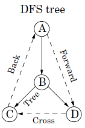
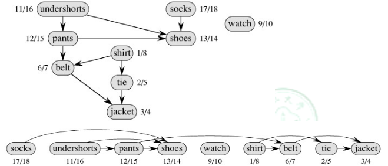

# 有向图边的类型

有向图边有如下几个类型：
- tree edge 树边
- foward edge 前向边
- back edge 回边
- cross edge 横跨边

一张图即可解释：



# 判断有向图边的类型

在DFS的过程中，可以直接用pre, post 值来判断；当然首先得知道如何计算 pre, post 值，这同样可以用一张图来解释（该图数对为 pre,post）：


- 如果一个点pre和post值不存在，说明该点未被访问过，是一个 **树边** （例如图中```F->G```)
- 如果 ```pre(u) < pre(v) < post(v) < post(u)```，说明 u 肯定 v 的祖先
    - 若有 v->u， 则该边是一个 **回边**；（例如图中```F->B```)
    - 若有 u->v, 且显然此时pre(v)和post(v)都存在，不可能是树边，则该边是 **前向边** （例如图中```E->G```)
- 对于 **横跨边**，已经是分属两条不同的深搜路径，所以必然的，两个点的(pre,post)区间没有重叠（例如图中 ```D->H```

可以总结为下图：


# 应用

## 判断有向图是否有圈

等价于判断图中是否有 **回边**

## 进行拓扑排序

首先要知道什么是拓扑排序：拓扑排序就是将结点依次排序，使得图内的边都是从该序列前面的点流向后面的点（显然前提是这个图不能有环）

例：穿衣服问题，见下图。



**正如图中所示，只要按Post值倒序就可以了**

> 当然这题还有另外的解法：不断从图中删去in-degree为0的点（source）