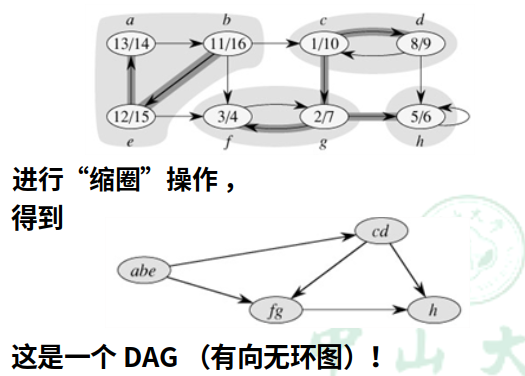

# 强联通分量

## 定义

Definition: A strongly connected component (SCC) of a directed graph G = (V, E) is a maximal set of vertices C ⊆ V such that every pair of vertices u and v in C are reachable from each other.

翻译过来就是，把一个有向图划分成**尽可能大**的几个集合，集合内的结点两两互相都可达，这样的每一个“集合”就是一个**强连通分量**

## 求解过程分析

> 求解一个有向图的强连通分量的算法不是一蹴而就的，下面就叙述一下这个算法逐步形成的过程

- 将强连通分量都“缩圈”缩成一个点，得到的图是**DAG**（有向无环图） —— 任何一个有向图都是其 强连通分量 组成的DAG

- 一个DAG，一定会有Sink（入度为0的点）和Source（出度为0的点）

- 如果能从Sink联通量里面任意一个点开始DFS，就可以求出这个Sink联通量，因为它**跑不出去**。

- 然后删去这个联通量，DFS树仍有叶子——就是仍有Sink，**重复上述操作**

可是问题就在于：并无法找到Sink联通量里的一个点。那该怎么办呢？

- 虽然没法找到Sink联通量，但我们可以找得到**Source**：在完整DFS过程以后，Post值最大的就一定在Source联通量内：
    - 假设从Source内的点开始DFS，显然Post最大的就在Source内（Root）
    - 假设不从Source内的点开始DFS，Source是到不了的；后面必然又要从Source内的点再次DFS，导致Post值最大

但找到Source也没有用啊，从Source内的一点开始DFS，肯定会**跑出去**，那有什么用呢？

- **把边反向，Source就变成了Sink**，而且联通的性质是不变的——强联通量还是那些强联通量

- 这样就可以从Post最大的值开始DFS，找出第一个强联通量，并且从图中删去
- 更棒的是，删去第一个强联通量以后，**现在Post最大的就是删后图的Sink值**，这样就可以不断重复前面的步骤

## 求解步骤总结

> 如果完整地看完了上面，下面的求解步骤可以直接忽略的啦

1. 进行DFS，求出每个结点的Post值，存入优先队列
2. 将有向图边反向 $G {\rightarrow} G^T$
3. 从Post值最高的点开始DFS，并将DFS所得的点存入一个集合，形成一个强连通分量；同时将这些点从图中删去
4. 重复第三步，直到所有联通量都形成

## 复杂度分析
- 第一次DFS求Post值并放入优先队列： 
  $O(V+E) + O(log_2V) = O(V+E)$
- 将有向图边反向： 
  $O(V+E)$
- 求强联通量的过程，实际上加起来就是一次完整的DFS而已： 
  $O(V+E)$

### 总复杂度

$O(V+E)$