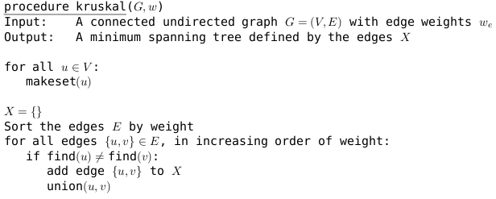
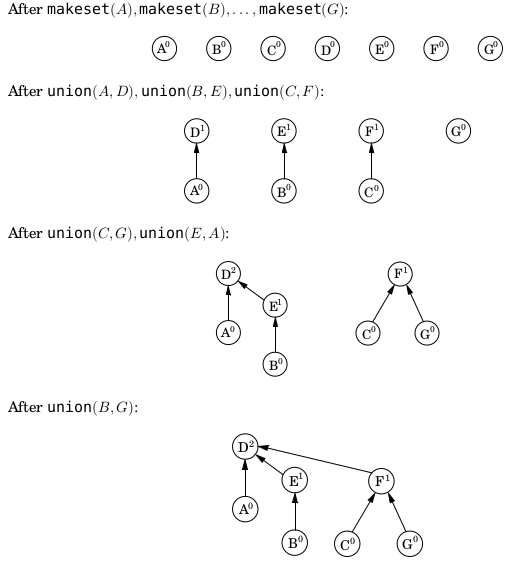
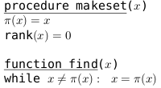
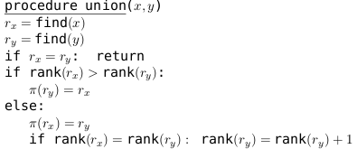

# 最小生成树

## Kruskal算法

**步骤**：每次都从图中找出【权值最小，且加入后不构成换】的edge，划入树中<br>

问题1：如何判断新加入的edge**是否构成环**？<br>
答案：使用**并查集**
  1. 一开始，每个点为一个集合
  2. 加权值最小的边，且每次新加的边不能是同一个集合的两点（同一个集合内的点是相互联通的，连上就构成环了）
  3. 将边所连的两个集合合并，形成一个更大的集合。

伪代码：



问题2：如何**存储集合**?<br>
答案：用树来存储集合，每个结点有一个 ```parent```变量存储父节点和```rank```变量存储深度；根结点```parent```指向自己（当然我觉得指向null问题也不大）



> 注意，这里记录了每个点的rank值，为的是使得每次并集的时候，可以**将rank较小的连到rank较大的结点**上，从而导致**树高度较小**，查询更快；像最后一步如果D->F,显然不是我们想要的结果

**伪代码**





**时间复杂度**：
- makeset操作 $O(E)$
- 边排序部分 $O(ElogE)$
- 其他部分 $O(E)$ 
> 其实没有太搞懂后面并操作的复杂度怎么算，但思考了一下不会有边排序那么高...可能还是得回头好好看看书

总复杂度$O(ElogE)$，也即$O(ElogV)$.