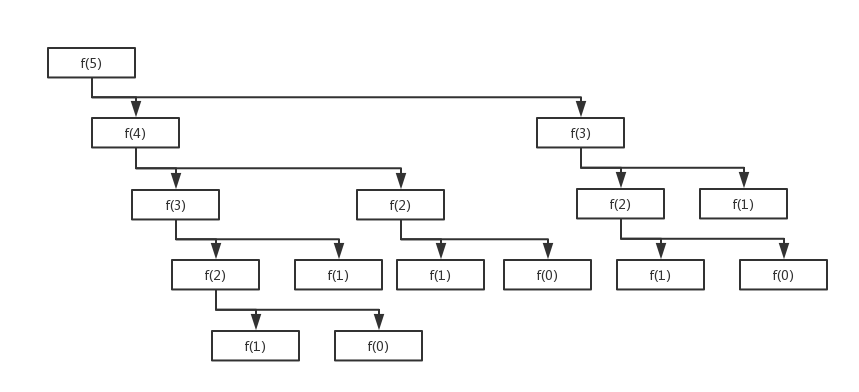
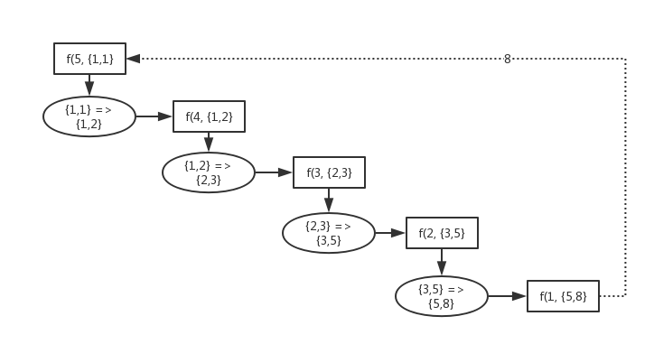

# 尾递归

尾递归：递归函数中，递归调用的语句是整个函数的最后一条执行语句。

正常情况下，递归调用会使编译器在内存新建一个栈帧，原函数的栈帧也需要保留知道新的调用返回结果

当编译器检测到一个函数调用是尾递归的时候，它就覆盖当前的活动记录而不是在栈中去创建一个新的。

编译器可以做到这点，因为递归调用是当前活跃期内最后一条待执行的语句，于是当这个调用返回时栈帧中并没有其他事情可做，因此也就没有保存栈帧的必要了。

通过覆盖当前的栈帧而不是在其之上重新添加一个，这样所使用的栈空间就大大缩减了，这使得实际的运行效率会变得更高。

> 注意这是编译器自动执行的，我们只需要写出一个尾递归的函数就可以了

# 例子

使用斐波那契数列计算作为例子

```go
package main import ( "fmt" ) 

// 非尾递归 
func fibonacci(n int) int { 
    if n <= 1 { return 1 }
    else { 
        return fibonacci(n - 1) + fibonacci(n - 2) 
    } 
} 

// 优化为尾递归 
func fibonacci2(n int, args [2]int) int {  
    if n <= 1 { 
        return args[1]
    } else { 
        args[0], args[1] = args[1], args[0] + args[1] 
        return fibonacci2(n-1, args) 
    } 
} 

func main() { 
    // 计算时间过长 
    //fmt.Println(fibonacci(1000)) 
    
    // 很快算出来 args := [2]int{1, 1,}
    fmt.Println(fibonacci2(1000, args)) }
```

对于非尾递归的`fibonacci1(5)`，执行情况大致如下：



对于尾递归的`fibonacci1(5,args)`，执行情况大致如下：



虽然依旧是递归的程序，但是编译器会自动优化，只会保留一个栈帧。