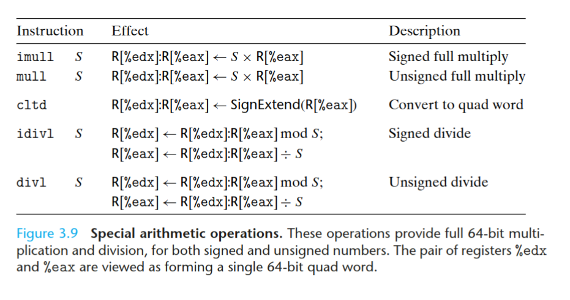
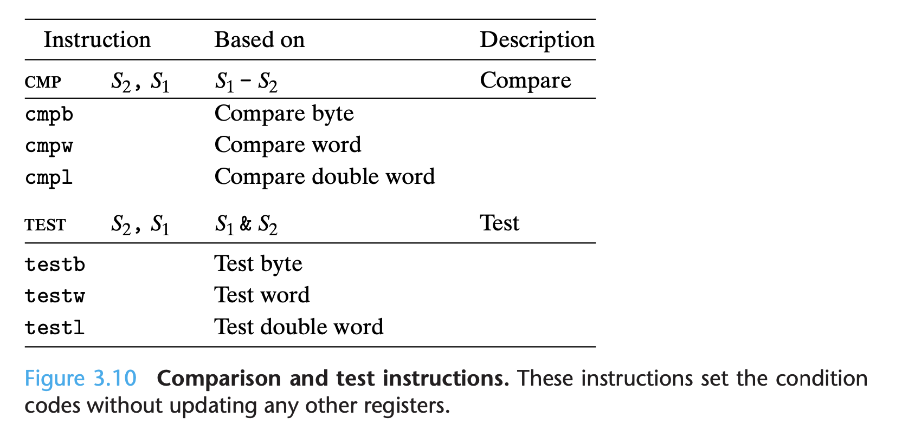
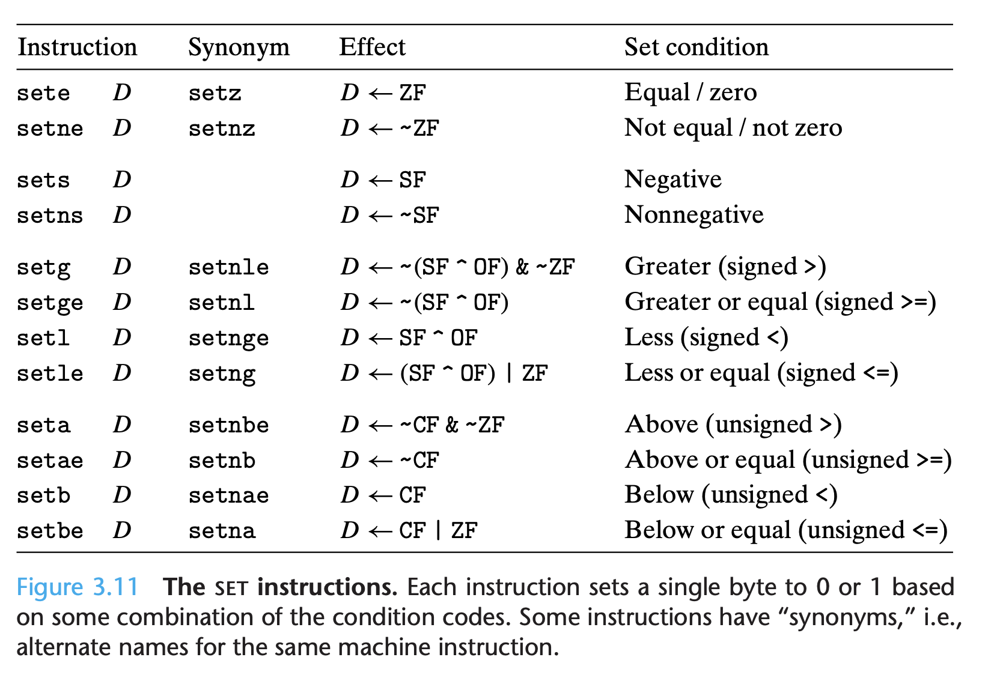

# Chapter 3 程序的机器表示(汇编)

## 引言

高级语言的优势
- 类型检查: 规避直接写汇编操作数据时的不一致行为
- 高级语言写的程序能在多个平台被编译，而汇编代码就非常 machine specific

本章学习两个汇编语言，并学习C语言是怎么编译成对应汇编
- IA32
- x86-64

**深入细节和例子，不要浮于表面的概念**

- 编译器集成了很多向后兼容的功能，要结合历史去看
- 编译器会做很多很多优化，不关掉甚至看不出原来的程序是啥样

本章内容 
- C、汇编、机器语言的关系 
- 深入学习 IA32
  - 数据表示
  - 控制流的实现(if, while, switch等)
  - 运行时(procedures, stack)
  - 复合数据类型(array, struct, union)
- 内存地址错误引用、系统漏洞、GDB

(web aside) 汇编和C结合
- 在linking stage将汇编和C函数结合
- gcc支持C函数中嵌入汇编

## 历史

x86: Intel processor line
- 8086, 8088 IBM 个人电脑 (16-bit)
- 8087 floating-point coprocessor (x87)
- i386 32bit, first to support Unix OS, 1985
- PentiumPro, P6 micoarchitecture, "conditional move" instructions
- Pentium III, SSE(操作整数向量、浮点数的指令集)
- Pentinum 4E, 超线程(一核跑两程序)，支持64位(在amd_64之后)
- core2: 多核
- corei7: 超线程+多核, 2008

最初的8086和80286的内存模型已经过时，Linux使用平面寻址(进程空间是一块连续的内存数组)

GCC默认为i386编译(很老了), 只有给定编译参数或编译64位的操作，才能使GCC使用更多新拓展
> 比较好奇，现在还是这样吗; 自己试了一下并不是这样

## 汇编代码初窥

C编译过程
- preprocessor #include, #define
- compiler --> .s汇编
- assember --> .o 二进制(不可重定向?), global values地址未填入
- linker --> 最终可执行文件

两个重要抽象
- 指令集架构(ISA)
  - 对处理器的抽象
  - IA32, X86-64都是ISA，都把指令抽象为顺序执行
- 虚拟内存
  - 对物理内存的抽象
  - 二进制程序使用的内存是虚拟内存(?)

相比较C语言，IA32机器码显示更多C看不到的 **处理器状态**
- 程序计数器 (PC, `%eip`)，指示下一个执行指令的内存地址
- integer register file * 8
  - 存 32-bit 数据 
  - 地址(C指针)、数据、程序状态、栈变量、函数返回值
- condition code register
  - 最近执行的算数或逻辑运算信息
- floating-point registers

### 代码示例

```c
int accum = 0;
int sum(int x, int y)
{
  int t = x + y;
  accum += t;
  return t;
}
```

```sh
> gcc -O1 -S code.c
```
> 汇编代码和书上的示例不一样，即使加上`-m32`参数也是，如下，后面再研究
```asm
	.file	"code.c"
	.text
	.globl	sum
	.type	sum, @function
sum:
.LFB0:
	.cfi_startproc
	endbr32
	call	__x86.get_pc_thunk.dx
	addl	$_GLOBAL_OFFSET_TABLE_, %edx
	movl	8(%esp), %eax
	addl	4(%esp), %eax
	addl	%eax, accum@GOTOFF(%edx)
	ret
	.cfi_endproc
.LFE0:
	.size	sum, .-sum
	.globl	accum
	.bss
	.align 4
	.type	accum, @object
	.size	accum, 4
accum:
	.zero	4
	.section	.text.__x86.get_pc_thunk.dx,"axG",@progbits,__x86.get_pc_thunk.dx,comdat
	.globl	__x86.get_pc_thunk.dx
	.hidden	__x86.get_pc_thunk.dx
	.type	__x86.get_pc_thunk.dx, @function
__x86.get_pc_thunk.dx:
.LFB1:
	.cfi_startproc
	movl	(%esp), %edx
	ret
	.cfi_endproc
.LFE1:
	.ident	"GCC: (Ubuntu 9.3.0-17ubuntu1~20.04) 9.3.0"
	.section	.note.GNU-stack,"",@progbits
	.section	.note.gnu.property,"a"
	.align 4
	.long	 1f - 0f
	.long	 4f - 1f
	.long	 5
0:
	.string	 "GNU"
1:
	.align 4
	.long	 0xc0000002
	.long	 3f - 2f
2:
	.long	 0x3
3:
	.align 4
4:
```

disassemblers: 由机器码到汇编码
```
> objdump -d code.o

code.o：     文件格式 elf64-x86-64


Disassembly of section .text:

0000000000000000 <sum>:
   0:	f3 0f 1e fa          	endbr64 
   4:	8d 04 37             	lea    (%rdi,%rsi,1),%eax
   7:	01 05 00 00 00 00    	add    %eax,0x0(%rip)        # d <sum+0xd>
   d:	c3                   	retq 
```

看看32位(加`-m32`参数)的：
```sh
> objdump -d code.o

code.o：     文件格式 elf32-i386


Disassembly of section .text:

00000000 <sum>:
   0:	f3 0f 1e fb          	endbr32 
   4:	e8 fc ff ff ff       	call   5 <sum+0x5>
   9:	81 c2 02 00 00 00    	add    $0x2,%edx
   f:	8b 44 24 08          	mov    0x8(%esp),%eax
  13:	03 44 24 04          	add    0x4(%esp),%eax
  17:	01 82 00 00 00 00    	add    %eax,0x0(%edx)
  1d:	c3                   	ret    

Disassembly of section .text.__x86.get_pc_thunk.dx:

00000000 <__x86.get_pc_thunk.dx>:
   0:	8b 14 24             	mov    (%esp),%edx
   3:	c3                   	ret    
```

> 那么问题来了，IA32 和 i386的区别？ -- IA-32 (short for "Intel Architecture, 32-bit", sometimes also called i386) from wikipedia; 所以就是一个东西了

- IA32 为变长指令集 $\in [1,15]$ bytes
- 注意到 `objdump -d` 和 `gcc -S` 生成的指令有不同 (比如 `addl` 变成了 `add`)，这是命名规范的差别 (比如这里的`l`是大小标记，大部分时候可以被忽略)
- > 另外我查到 `.` 开头的是给assembler的注解

新建一个main.c来调用sum:
```c
int main()
{
  retur sum(1, 3);
}
```
```sh
> gcc -O1 -o prog code.o main.c
```
> 这个时候code.o还是-m32编译的，所以会报错:
```
/usr/bin/ld: i386 architecture of input file `code.o' is incompatible with i386:x86-64 output
/usr/bin/ld: i386 architecture of input file `main.o' is incompatible with i386:x86-64 output
``` 
> 但此时即使用-m32参数来链接也会出错，还搞不懂
```
/usr/bin/ld: 找不到 Scrt1.o: 没有那个文件或目录
/usr/bin/ld: 找不到 crti.o: 没有那个文件或目录
/usr/bin/ld: 当搜索用于 /usr/lib/gcc/x86_64-linux-gnu/9/libgcc.a 时跳过不兼容的 -lgcc
/usr/bin/ld: 找不到 -lgcc
/usr/bin/ld: 当搜索用于 /usr/lib/gcc/x86_64-linux-gnu/9/libgcc.a 时跳过不兼容的 -lgcc
/usr/bin/ld: 找不到 -lgcc
collect2: error: ld returned 1 exit status
```
> 所以先回归使用64位(default)，后面学的时候再去研究

使用`objdump`分析新生成的`prog`可执行文件，这时候文件大多了，就只看`sum`函数部分：

```asm
0000000000001129 <sum>:
    1129:       f3 0f 1e fa             endbr64 
    112d:       8d 04 37                lea    (%rdi,%rsi,1),%eax
    1130:       01 05 de 2e 00 00       add    %eax,0x2ede(%rip)        # 4014 <accum>
    1136:       c3                      retq   
```
可以看到和 `code.o`的反汇编相比，首先是指令的地址改变了(shifted by linker)；其次是确定了全局变量`accum`的存储位置 (`0x2ede`)，见下面：
```
7:	01 05 00 00 00 00    	add    %eax,0x0(%rip)        # d <sum+0xd>
1130:   01 05 de 2e 00 00       add    %eax,0x2ede(%rip)        # 4014 <accum>
```
> 可以注意到这里是小端模式，所以字节顺序 `de 2e` 和地址 `0x2ede` 反了

## 数据表示

由于历史16-bit架构原因，Intel使用"word"来表示16-bit数据类型，而对应32和64是"double words", "quad words".

以下表格是C内置类型在 IA32 的表示：
C declaration| Intel data type | Assembly code suffix |Size (bytes)
--|--|--|--|
char|Byte |`b` | 1| 
short|Word|`w`|2|
int|Double word|`l`|4
long int|Double word|`l`|4|
long long int|—|—|4
any pointer|Double word|`l`|4
float|Single precision|`s`|4
double|Doub1le precision|`l`|8
long double|Extended precision|`t`|10/12

- 大部分都是"double words"，不管有符号还是无符号
- 所有指针都是 doubler words
- **C语言中的 `long long int` 并不被IA32硬件支持，所以编译器要转成一系列对 32-bit (double words)的操作**
- 浮点数用的是另外一套表示体系，具体看表，gcc 使用 `long double`表示拓展精度
- gcc编译的汇编代码有一个后缀，表示操作数的大小
  - 比如数据移动指令 就有几个变形 `movb`, `movw`, `movl`
  - 尽管 Double Word 的汇编指令后缀 和 Single Precision 相同 (都是`l`)，但这没有关系，因为**浮点数用的是完全不同的汇编指令和寄存器**
- > 不知道64位会是怎么样的，之后可以留意一下

## 数据访问

### 整数寄存器
- IA32-CPU有8个32位寄存器，存储整数数据和指针(前面有提到过);
- 这些寄存器都以 `%e` 开头; 
- 在8086时，每个寄存器有独特的用途，不过flat addressing(线性地址空间)使得寄存器的专用性消失了
- 通常来说，前6个是通用寄存器
  - 前3(`%eax`,`%ecx`,`%edx`)又和后3(`%ebx`,`%esi`,`%edi`)在存取数据又有一定差异(后面会详细讲)
  - 前4(`%eax`,`%ecx`,`%edx`,`%ebx`)为了向前兼容, 分为 1byte-1byte-1word(刚好32bit)三个区域，可以独立存取;
    - 比如`%eax`分为`%al`,`%ah`,`%ax` 三个部分，剩余三个寄存器命名类似
    - 刚好可以用来处理`short`类型数据
- 后2个用来存放指针和堆栈，有严格的存取规范
  - `%esp`: stack pointer
  - `%ebp`: frame pointer
- > 64位有些是以`%r`开头, 刚好后四个都是: `%rsp`,`%rbp`, `%rdi`,`%rsi`


### 指令操作数

- 三种类型的操作数：**立即数、寄存器值、内存引用**
- 内存引用最复杂
  - 通过计算所得的**有效地址**访问内存数据
  - 最常见的形式是 $Imm(E_b,E_i,s)$
    - $Imm$是一个代表偏移量的立即数
    - $E_b$是基地址寄存器 base register
    - $E_i$是索引寄存器 index regiser
    - s是比例因子 scale factor, 且只能是 1,2,4或8
  - **有效地址计算公式**: $$Imm+R[E_b]+R[E_i]\cdot s$$
  - 引用数组元素时很常见上面这种形式; 而其他内存表示形式也更像是这种形式的特例


### 数据移动指令
- **叫数据拷贝还差不多**
- 基本上是最常用的指令了
- 5个类别，每一类内的所有指令执行相同操作，区别在于操作数大小不同
  - `S` 和 `D` 都代表操作数，其中`S`(source)只可以是立即数、寄存器值或内存值，而`D`(destination)只能是某个寄存器或内存地址
  - **两个操作数不能都指向内存**
  - `mov S,D`: $S\rightarrow D$
    - `movb`: 移动`byte`(8bit); 寄存器(`%ah`~`%bh`, `%al`~`%bl`)
    - `movw`: 移动`word`(16bit); 寄存器(`%ax`~`%bp`)
    - `movl`: 移动`double word`(32bit); 寄存器(`%eax`~`ebp`)
    -  [ ] **如果立即数长度超过指令规定，会截掉高位吗，还是报警**
       - 应该是会截掉高位，见Problem 3.4，TOC
  - `movs S,D`: $SignExtend(S)\rightarrow D$
    - `movsbw`, 移动`byte`到`word`
    - `movsbl`, 移动`byte`到`double word`
    - `movswl`, 移动`word`到`double word`
  - `movz S,D`: $ZeroExtend(S)\rightarrow D$
    - `movzbw`, `movzbl`, `movzwl`, 操作数大小意义同`movs`
    - **`movs`是高位补符号位，`movz`是高位补0**
  - 栈操作
    - **和函数调用密切相关**
    - **栈空间从高位往低位拓展**
    - `pushl S`: Push double word; 以下是运算步骤
      1. ($R[\%esp]-4)\rightarrow R[\%esp]$
      2. $S\rightarrow M[R[\%esp]]$
      - `pushl %ebp`等价于: 
      1. `subl $4,%esp`
      2. `movl %ebp,(%esp)`
    - `popl D`: Pop double word; 以下是运算步骤
      1. $M[R[\%esp]]\rightarrow D$
      2. $R[\%esp]+4\rightarrow R[\%esp]$
      - `popl %eax` 等价于
      1. `movl (%esp),%eax`
      2. `addl $4,%esp`
- disassembler 没有操作数大小后缀, gcc有
  - IA32内存引用地址都是用的32位寄存器，而且只标明地址，没标明数据大小; 所以实际指令后缀要看另一个操作数的大小 (可见Problem3.2)
  - 操作数大小和指令不匹配会报错(见Problem3.3)

### 数据移动示例

```c
int exchange(int *xp, int y) {
    int x = *xp;
    *xp = y;
    return x;
}
```

```
<!-- gcc -O1 -S -m32 -->
movl	4(%esp), %eax
movl	(%eax), %edx
movl	8(%esp), %ecx
movl	%ecx, (%eax)
movl	%edx, %eax
```

- 跟书上(3.4.3)所得结果有些差异，但不算大:
  - `x`并没有直接存到`%eax`，而是在最后一步才从`%edx`存到`%eax`
  - 因为一开始取`*xp` 先取到了`%eax`(并没有那么聪明)
- 值得关注的点：
  - C指针存的是地址值，解引用首先先从栈中取出该地址到寄存器，然后再利用该寄存器得到一个内存地址引用
  - 局部变量通常存在寄存器中，能不用到内存就不用(这个估计要到编译原理才能搞懂编译器是怎么判断的了)
  - **int函数返回值是 `%eax`, TOC**
- Problem 3.4，将int存到char(强制类型转换): `movb %al, (%edx)`

## 算数逻辑操作

### 常用运算符


**除了 `leal` 以外，表中别的运算符都有不同操作数大小的后缀**

**获取有效地址**:
- `leal S,D`: $\&S\rightarrow D$, 其中`&`是指取地址符(类似C中的)
- 长的像`movl`，但不是取`S`的值，而是地址本身；所以其实本质上就是进行有效地址计算，可参见前文的**有效地址计算公式**
- **`D`必须是个寄存器**
- 用于指针取址操作
- **也以后可能用来简化一般的算术运算**
  - `leal 7(%edx,%edx,4), %eax` 其实是将 `5*[%edx]+7`赋值给`[%eax]`
  - 不过要注意比例因子只能是 1,2,4,8

**单目运算符**:
- `INC`自增1,`DEC`自减1,`NEG`取负,`NOT`取反
- **操作数可以是寄存器也可以是内存地址**

**双目运算符**:
- `ADD`,`SUB`,`IMUL`,`XOR`,`OR`,`AND`
- **第二个操作数`D`既是source也是destination**
- **形式都是 `D [op] S --> D`**, 比如`SUB S,D` 就是 `D-S-->D`
- 操作数形式规则和`mov`一样，`S`可以是立即数/寄存器值/内存值, `D`只能是寄存器/内存, **且两个操作数不能同时为内存地址**
- 优化`x=0`的存储(Problem3.10)
  - `xorl %edx,%edx`只用2bytes存，而`movl $0,%edx`需要5bytes!
- **2.3.4和2.3.5解释了 32-bit * 32-bit 留 32-bit, 对于有符号和无符号来说是一样的，因此`IMUL`没分有符号无符号**

**移位运算符**:
- 第一个操作数是shift amount，第二个是被shift的数
- shift amount可以为立即数，**但只能是寄存器%cl**
- 由于shift amount只会属于 [0, 31], 因此只用1byte存, 且只取低位的5byte
- `SAL`, `SHL` 是等价的左移运算符
- `SHR`是逻辑右移(填0), `SAR`是算术右移(填1)
  - 可以想到无符号数要用`SHR`, 有符号数要用`SAR`

> 别忘了除了`leal`以外，上述指令都有不同操作数大小之分

### 特殊操作符

- 乘法
  - 这里的`imull`算的是有符号 `32-bit*32-bit=64bit` (注意到如果是保留64-bit的话有符号无符号就有区别了); 
  - **对于`imull`, 两个操作数代表上面的(`32*32-->32`)的, 一个操作数就是这里`32*32=64bit`**
  - 对应的`mul`是无符号的`32*32=64bit`
  - 对于上述两个乘法操作，都只有一个操作数`S`, 运算过程都是 $S\times R[\%eax] \rightarrow R[\%edx]:R[\%eax]$
- 除法
  - `idivl S`: 有符号除法
    - $R[\%edx]:R[\%eax] mod\ S  \rightarrow R[\%edx]$
    - $R[\%edx]:R[\%eax] \div S  \rightarrow R[\%eax]$
  - 当需要除一个有符号32位数时，显然需要先extend
    ```
    1 movl    8(%ebp), %edx // Put x in %edx
    2 movl    %edx, %eax // Copy x to %eax
    3 sarl    $31, %edx // Sign extend x in  %edx 
    4 idivl   12(%ebp)  // Divide by y
    5 movl    %eax, 4(%esp) // Store x/y
    6 movl    %edx, (%esp) // Store x%y
    ```
    line1~3就是有符号extend并存到%eax，可以直接用指令`cltd`替换(Intel里叫`cdq`)，该指令有符号扩充%eax到%edx
    ```
    1 movl    8(%ebp), %adx // Put x in %eax
    2 cltd    // Sign exted into %edx
    3 idivl   12(%ebp)  // Divide by y
    4 movl    %eax, 4(%esp) // Store x/y
    5 movl    %edx, (%esp) // Store x%y
    ```
  - `divl S`: 无符号除法， 这时候给`%edx`extend就直接扩充0就行了



TODO: Problem 3.12 搞不懂

## 控制语句

机器语言检验数据的值，并以此改变控制流或数据流，来实现条件式行为；依赖数据的控制流是更常用的方式

> 控制流 v.s. 数据流? 

本节先讲解机器语言所支持的机制，然后了解如何通过这些机制来实现C语言的控制语句; 
最后会讲解使用条件数据来实现数据依赖的行为(???在说什么)

### 状态码

单bit寄存器，保存最近的算术、逻辑操作结果
- CF: Carry Flag, 最高位的进位输出，**用于检测无符号数运算的溢出**
- ZF: Zero Flag, 运算结果是否为0
- SF: Sign Flag, 运算结果是否为负数
- OF: Overflow Flag, **用于检测是否有符号数(补码)的溢出**

假设有C语句 `t=a+b`, 其中三个变量都是 `int`，对应状态码的设置等价于如下C语句:
- CF: `(unsigned) t < (unsigned) a` (无符号溢出肯定小于两个数中的任何一个)
- ZF: `(t == 0)`
- SF: `(t < 0)`
- OF: `(a < 0 == b < 0) && (t < 0 != a < 0)` (有符号溢出意味着`a` `b`同号而结果`t`异号)
 
**对于各个运算符的规则**：
- 除`leal`外图3.7(常用运算符)的运算符都会设置这些flag; `leal`不会改变状态码，因为本身就是为了内存地址计算而存在的; 
- 对于逻辑操作(比如`XOR`), CF 和 OF 都被设为0 (不可能有溢出)
- 对于shift, CF被设为**最后被移出去**的那bit, 而OF被设为0
- `INC`和`DEC`(自增自减)会设置 OF ZF, 但不改变 CF (此处没展开讲原因)

**还有一些运算符能直接设置状态码寄存器，而不用像上面那些运算符那样同时会改变其他寄存器**:

- 两个类别, 都支持8, 16, 32位形式 
  - `cmp`类似sub, 但没有目标寄存器/内存; ZF可以判断是否相等, 再利用其他flag可以判断大小关系(**HOW**)
  - `test`类似and, 同样也是只改状态码; 通常使用相同两个相同operand来判断 负/0/正; 又或者用其中一个数当掩码来验证某一位

**取用状态码**:

有三种方式：

1. `SET`指令

- 基于状态码的某种组合设置某1byte
- 目标地址 `D` 只能是那8个1-byte寄存器 (%ah, %al..)或者某个1-byte内存地址，并将这一byte整个设为0/1; 因此要生成32位(double word)结果的话，还要清空高24位
  对于C语言中表示 `a<b`，且两个变量都是`int`的IA32表示如下
  ```
  # 假设 a 在 %edx, b 在 %eax
  cmpl %eax, %edx
  setl %al
  movzbl %al, %eax
  ```
- **尽管很多指令会设置状态码，不同SET指令更符合在CMP指令执行以后，根据运算`t=a-b`的结果对状态码进行检测**
  - 当`a=b`时，ZF就为1，因为`sete`就和 "=" 等价了
  - 对于`setl = SF^OF` 需要分情况讨论来验证`setl`确实表示 `a<b`
    - 假如没有溢出(`OF=0`)，而且有 `a-b<0`(`SF=1`), 此时可得出 `a<b`的结论; 而`a-b>=0`时则有 `a>=b`
    - 假如发生了溢出(`OF=1`)，则当 `a-b>0`时(a负b正，且溢出为正数，`SF=0`)有 `a<b`; 而 `a-b<0`时(a正b负，且溢出为负数，`SF=0`)则有`a>b`; 有溢出时不可能有`a-b=0`
    - > 这里确实有点难理解，要自己画数轴理解一下
    - 其他**有符号数**的比较检验可以自行推理一下，都是基于`SF^OF`和`ZF`的组合
  - 对于无符号数就更可以自行推理了，基于 `CF`和`ZF`的组合

TODO: Problem 3.13

## TODO

RIP, RBP, RSP, RDI, etc.
These are the same as EIP, EBP, ESP, EDI, etc. but are used in 64-bit systems. Essentially, they are the same names except with an R instead of an E.

x86寄存器列表 https://www.eecg.utoronto.ca/~amza/www.mindsec.com/files/x86regs.html

为什么两个操作数不能同时为内存地址(mov, 双目算数逻辑运算符)