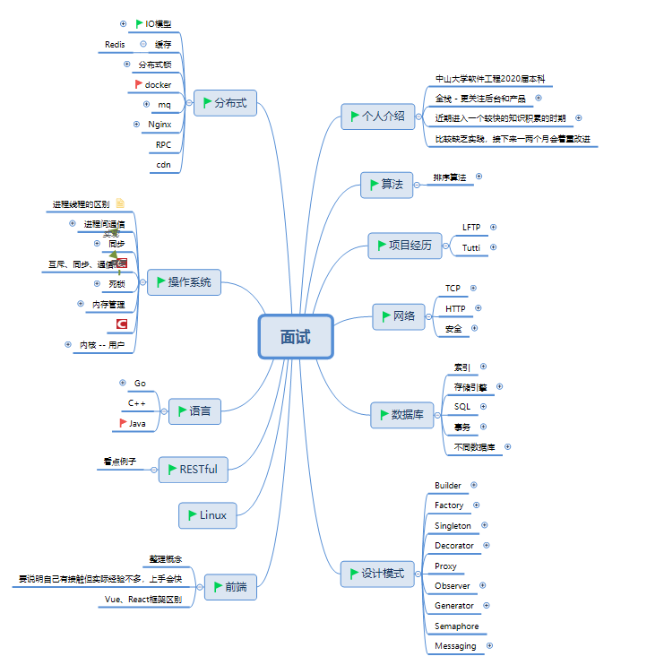

# 面试准备

在上次面试准备的基础上，利用几天时间又增加了一些内容，最大的收获就是对HTTP2.0的一些研究和思考。

# 面试过程

一上来做完自我介绍以后，就直接问最近做的项目，但说实话我最缺的就是项目经验了，只能把最近做的小程序项目搬出来讲讲。

首先讲这两个内容：

- 产品功能，设计思路
- 数据库设计思路，延展性

然后我觉得方向不太对，就赶紧往别的方向扯：

- 小程序加载调优（我没有引入实际工具来进行测试，所以也赶紧引到下一点）
- HTTP2.0与1.1的加载区别

面试官扯别的话题：

- 阻塞、非阻塞，异步、非异步IO
- 网络IO多路复用 (select, poll, epoll)
- 回调机制

# 总结

- 项目涉及的后台技术点太薄弱，需要增加项目经历，将上述提到的知识点尽量地多使用
- Tutti项目的整体思路不清晰，在产品分析方面太薄弱。