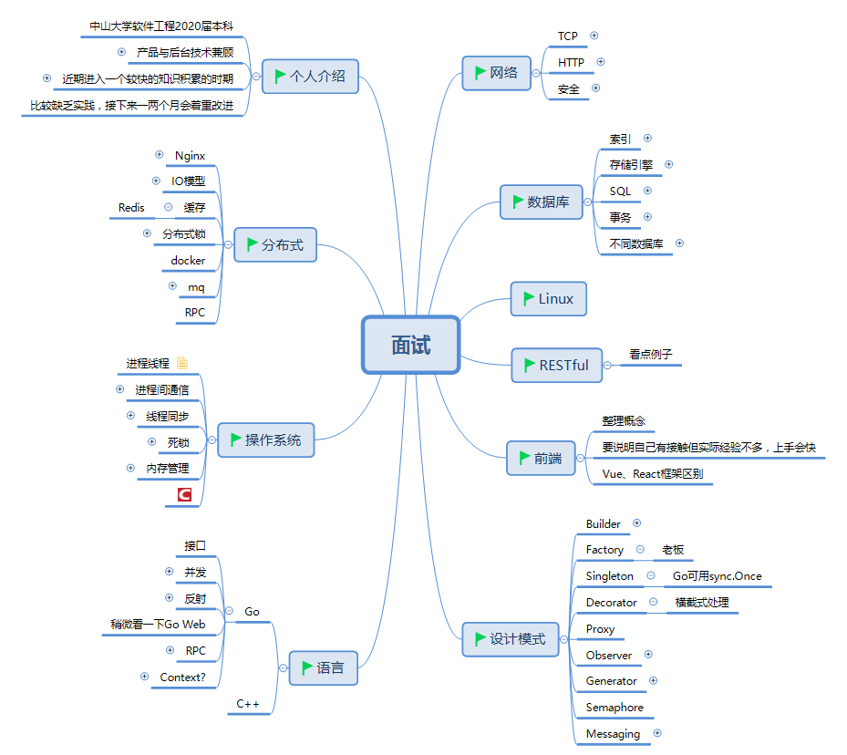

# 面试准备

由于自己简历上写的内容有点偏向Go后台，所以我准备的时候也完全是朝着Go开发的思路去准备，具体内容有这些.

> 这次面试我还给自己准备了一个臭长臭长的自我介绍

# 面试过程

面试一开始我就直接问“需不需要进行自我介绍”，得到允许后我就开始一长篇的自我介绍 (其实逻辑还是蛮清晰的了毕竟做了提纲)，把自己的现状讲得比较清楚，感觉面试官还挺喜欢这一段的。

而后面试官给我介绍了部门的现状, 结果发现他们现在用的是Java，而我准备的是Go，考的就只能折中选一下C++了。(车祸的开始)

## 编程题

都是很基础的题目。

1. 变量所占内存空间
2. 按值传递的陷阱题
3. virtual覆盖
4. 选择排序
5. 二叉查找树镜像
6. SQL

## 问答环节

排序的方式，实现的原理

网络的五层

几个协议的作用 —— 我强行扯计网的LFTP项目和IO多路复用

高考成绩? —— 继续强行扯自己的学习能力