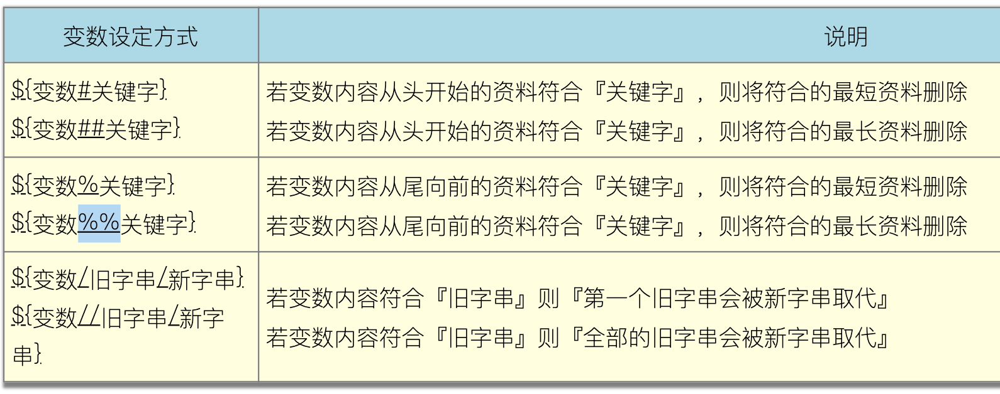
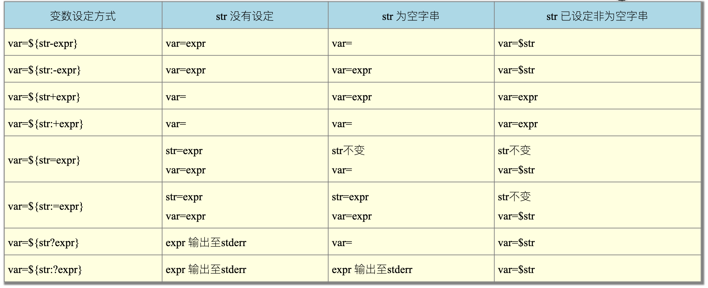
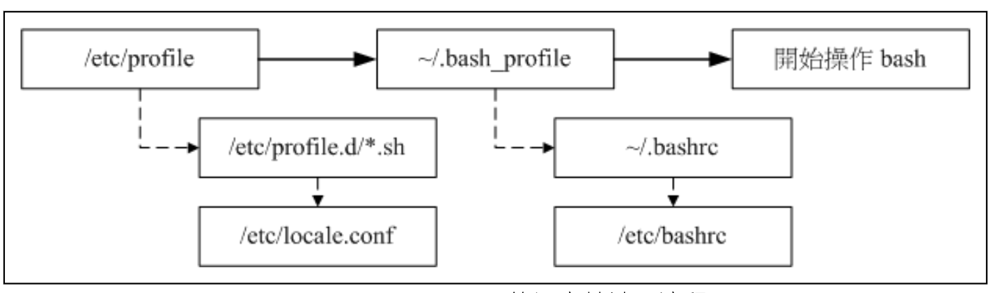

# Bash

## 概念

```
        USER
        ↓  ↑
Shell, KDE, Applications
        ↑  ↓
        Kernel
        ↑  ↓
        Hardware        
```

- 只要能够操作应用程序的界面程序都能够称为`Shell`
- Linux预设使用Bash

## 基础功能

- ↑↓ 历史命令
- 命令别名 `alias`, `unalias`, `\command` 直接调用
- Tab 命令、文件名补全
- 通配符
- 登入文字`/etc/issue`, `/etc/issue.net`

## 命令行快捷键

|快捷键|功能|
|--|--|
Ctrl + a|跳到命令行首部（home 也一样）
Ctrl + e|跳到命令行尾部（end也一样）
**Alt + f**|**光标向右移动一个单词尾**
**Alt + b**|**光标向左移动一个单词首**
Ctrl + u|删除从行首到光标
Ctrl + k|删除从光标到行尾
Alt + r|删除当前整行
**Ctrl + w**|**从光标处向左删除至单词首**
**Alt + d**|**从光标处向右删除至单词尾**
Ctrl + y|将删除的字符粘贴到光标后
Ctrl + l|小写L 清屏

## 变量

- 变量未被设定时，调用为“空”
- 设定：`var=Value`，中间不能空格
- 调用：`${var}`
- 读取：`read [-pt] var`，`-p`提示语，`-t`等待秒数
- 声明：`declare [-aixr] var`，参数分别是数组、整数、export、只读，**预设为字符串**
- 字符串强引用: `' '`，`$`之类的会保留原样；弱引用 `" "`，就可以在里面放变量了（弱引用用转义符`\`）
- `$(COMMAND)` 或 `点COMMAND点`(点就是`)
- **变量要在子程序中有效，要`export`为环境变量**
- `set`查看所有变量
- `unset`取消变量 (`unset PATH` 以后重登就好了..)
- 数组 `var[n]`


预设的一些bash变量（非环境变量）：
- `$` 本shell的PID（别忘了需要`$$`才能输出）
- `?` 上个命令的返回值，`0`为成功
- `PS1` 命令提示符，`PS2`为使用`\`换行后的提示符

### 环境变量

- `env`列出当前所有环境变量
- `export`设置环境变量
- 子程序仅会继承父程序的环境变量，不会继承普通变量（比如`PS1`）
- `declare -x var` 取消环境变量(仅限于自定的)
- 不要将 `.` 放入 `$PATH` 中, 防止恶意用户在公共文档 (例如`/tmp`) 写恶意脚本。在某个目录下执行命令是需要加`./`前缀的，而如果`.`放入`$PATH`中，则不需要前缀，那么一些常用可执行文件可被篡改（比如`ls`）
- 每个用户具有自己的 `$PATH`, 暂时更改:
    ```sh
    $ PATH="$PATH:/usr/local/bin"
    ```
- 永久更改自己的PATH: 在 `~/.bashrc` 文件下
    ```sh
    export PATH="$PATH:/usr/local/bin"
    ```
    然后执行:
    ```sh
    $ source ~/.bashrc
    ```
- 更改系统级环境变量则修改 `/etc/profile`, 执行上述两个步骤
  
常用环境变量：

- `PATH`
- `HOME`
- `MAIL`
- `SHELL`
- `LANG`
  - 后面介绍
- `RANDOM` 
  - 0~32767 随机数
  - `declare -i number=$RANDOM*10/32768`

### 语系相关变量

- `locale -a` 查看支持的语言
- 改变语言设置`locale`里显示的变量，但其实改了`LANG`和`LC_ALL`即可
- 设置中文在bash里会乱码，可以自行安装可显示中文的shell

### 变量部分删除和替换



### 变量验证



- 脚本里检测变量是否存在可以使用`exist=${var+expr}`，`$var`未设定则`$exist`为空；`$var`已设置（即使为空）则`$exist==expr`

## 限制用户的Bash资源 `ulimit`

`ulimit [-SHacdfltu] [配额]`

选项与参数：
```sh
-H ：hard limit ，严格的设定，必定不能超过这个设定的数值；
-S ：soft limit ，警告的设定，可以超过这个设定值，但是若超过则有警告讯息。
      在设定上，通常soft 会比hard 小，举例来说，soft 可设定为80 而hard 
      设定为100，那么你可以使用到90 (因为没有超过100)，但介于80~100 之间时，
      系统会有警告讯息通知你！
-a ：后面不接任何选项与参数，可列出所有的限制额度；
-c ：当某些程序发生错误时，系统可能会将该程序在内存的信息写成档案(除错用)，叫 core file。此为限制每个 core file 的最大容量。
-f ：此shell 可以建立的最大文件容量(一般可能设定为2GB)，单位为Kbytes
-d ：进程可使用的最大内存段(segment)容量；
-l ：可用于锁定(lock)的内存量
-t ：可使用的最大CPU时间(单位为秒)
-u ：单一使用者可以使用的最大程序(process)数量。
```

- 上面的参数说 `-f` 单位是 1K，但实际是1block，具体多大还要看系统：`tune2fs -l /dev/hda1 |grep "Block size"`
- `dd if=/dev/zero of=123 bs=1M count=20`创建一个20M的文件，之后去看文件系统原理会学到。
- 实际上这个功能用起来还是不清晰，需要再总结（`H`和`S`不知道怎么用，怎么显示）

## 命令历史

`history` 查看历史命令
- 登出也会保存到文件中
- 可以通过设置环境变量定制history
  - `$HISTSIZE` 命令历史条数
  - `$HISTFILE`: 持久保存命令历史的文件位置
  - `$HISTFILESIZE`: 上述文件大小
  - `$HISTCONTROL`: 控制命令历史的记录方式 
    - `ignoredups`: 忽略重复的命令
    - `ignorespace`: 忽略空白字符开头的命令
    - `ignoreboth`: 两者同时生效
- `!#`: 再一次执行 history 中的命令 
- `!STRING`: 执行最近的以`STRING`开头的命令
- `ESC + '.'` 或 `ALT+ '.'`: 上一条命令的最后一个参数，等同于 `!$`
- `!!` 再次执行上条命令
- 同时以同个用户登录多个bash会导致命令历史覆盖

## bash的环境配置文件

> 略过了许多具体的配置文件，暂时还用不上



- non-login shell 和 login shell，图形和子bash就是non-login，只有login shell会加载上述流程
- non-login 只加载`~/.bashrc`
- `stty` 终端操作环境设定

## 通配符

- `*`	0+个任意字符
- `?`	1个任意字符
- `[ ]`	1个在括号内的字元。例如`[abcd]` 代表a,b,c,d中的任意一个字符
- `[ - ]`	1个编码范围内的字符。例如`[0-9]` 代表1个数字
- `[^ ]` 1个括号范围外的字符（反选）。例如 [^abc] 代表非a, b, c 的任意1个字符

## 重定向

将指令执行的输出传输到其他地方，例如其他的文件或设备（打印机），也即改变默认IO设备

```
STDIN(0)：默认键盘
STDOUT(1)：默认当前终端窗口 (tty)
STDERR(2)：同上
```

### STDIN重定向

- `1>` 覆盖地重定向
  - `set -C`可设置无法覆盖已存在文件，`set +C`恢复
  - 强行覆盖 `>|`
  - `cat > filename` 可用于简单创建新文件，`Ctrl+D`结束
- `1>>` 累加地重定向（追加到原来内容）
  - 可用于**安全**地创建新文件;
- `1`可省略
- 多个命令重定向 `(ls;pwd) > filename`
- 例子：`ls > /dev/tty2` 输出的其他窗口

### 黑洞设备 `/dev/null`：

不希望输出的信息，就让黑洞吞掉吧
也可以用来清空文件 `cat /dev/null > filename`

### STDERR重定向
- `2>` 覆盖地重定向
- `2>>` 累加地重定向（追加到原来内容）
- `2` 不可省略!
- `&>` 把STDIN 和 STDERR输出到同一文件，**注意不能` > file 2>file`**（也可以 ` > file 2>&1`） 

### STDIN重定向
- `0<` 或 `<`
- 例子：`cat < /etc/issue`
- 复制：`cat < originfile > newfile`
- 多行重定向：`cat <<symbol`，并以单个symbol的一行结束,建议用EOF做symbol


## 命令执行的判断依据： `;` , `&&`, `||`

- `cmd; cmd` 无相关地连续指令下达
- `cmd1 && cmd2` 前一个指令成功才会执行下一个(`$?==0`)
- `cmd1 || cmd2` 前一个指令 **不** 成功才会执行下一个(`$?!=0`)
- 例子：
  ```sh
  ls /tmp/vbirding && echo "exist" || echo "not exist"
  ```

## 管道和管道命令

这部分也是属于Bash的功能，但内容比较重要和常用，就另开笔记来记录了。