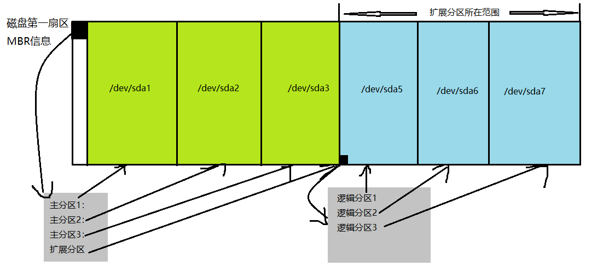

# 硬盘分区与开机流程

## 参考资料

- [鸟哥的Linux私房菜](http://linux.vbird.org/linux_basic/0130designlinux.php)
- [Linux就该这么学](https://www.linuxprobe.com/chapter-06.html#62)

## 设备命名规则
在Linux系统中，每个设备都被当做一个文件来对待，存储在`/dev`中

|硬件设备|文件名称|
|--|--|
|IDE设备|`/dev/hd[a-d]`|
|SCSI/SATA/U盘|	`/dev/sd[a-p]`|
|虚拟I/O界面(用于虚拟机)|`/dev/vd[a-p]`|
|软驱|`/dev/fd[0-1]`|
|打印机|`/dev/lp[0-15]`|
|光驱|`/dev/cdrom`|
|鼠标|`/dev/mouse`|

由于现在的IDE设备已经很少见了，所以一般的硬盘设备都会是以“/dev/sd”开头的。近年来为了统一处理，大部分Linux distribution已经将IDE接口的硬盘也模拟成SATA。

> 在Android中的虚拟机也被当做设备`/dev/kvm`，在后面会了解到kvm不仅仅是用作Android虚拟机这么简单

## 虚拟机

Linux系统内置 **KVM** 进行虚拟机操作，但实际上现在VirtualBox已有Linux版本，所以无需再使用命令行配置启动虚拟机，使用VirtualBox是个不错的选择。我也也尝试了用虚拟机制作WindowsXP+CentOS双系统，具体可以看[这里](virtual_double_sys.md)

> 其实主要是kvm用不会啦，第一次安装ubuntu就失败了，以后再尝试

## 硬盘分区

在解释硬盘前先要理解一下硬盘的一些基本原理。如果对硬盘构造不熟悉的话，可以参考[这篇博客](https://www.cnblogs.com/jswang/p/9071847.html)巩固一下硬盘的基础知识，包括扇区、磁道、柱面等概念。

硬盘的扇区一般有两种规格，分别是`512bytes`与`4Kbytes`；硬盘的第一扇区存储了该磁盘的分区的启动引导程序(boot loader，比如 grub)，以及硬盘的分区信息。

硬盘的信息记录和分区方式有两种，分别是 MBR 和 GPT。

### MBR

MBR 即 Master Boot Record(主引导记录)，是早期兼容Windows硬盘的一种硬盘信息管理方式。**最主要就是只使用硬盘的第一扇区来记录记录 boot loader 和 分区信息的方式**。这种分区方式支持的最小单位是柱面（一个“圈”，对于单盘来说就是磁道）

在早期MBR诞生时，硬盘的扇区只有 `512bytes` 这种规格，因此第一扇区同样也就是这么大。其中：
- `446 bytes`是启动引导程序(boot loader)
- `64 bytes` 即为分区信息，最多仅能有4组记录，每组记录区记录了该区段的起止柱面/磁道，构成**主分区**
- 对于物理结构上有n个面(磁头)的硬盘，其分区空间的最小值为: `n × 扇区/磁道 × 512Bytes`。

这么看起来一个MBR格式的硬盘就只能分四个分区了？其实不然。更多的分区是通过**扩展分区**来实现的。简单来说就是利用扩展分区中的额外扇区来记录更多的分区信息构成**逻辑分区**。看起来是这个样子：

其中 `/dev/sda[1-4]` 是分配给主分区和扩展分区（即硬盘第一个扇区所记录的分区）的，而逻辑分区就得从`/dev/sda5`开始了

另外，扩展分区的分区表也不是像图中那么简单，毕竟要可以支持几十个分区，仅用一个扇区肯定是不够的，[维基](http://en.wikipedia.org/wiki/Extended_boot_record)有讲实际的逻辑分区是怎么记录的。

> 当日后还有分区需要的时候，比较好的做法就是分3个主分区，然后后面的剩余空间都留给逻辑分区

**个人实践环节**

下面是博主使用虚拟机安装双系统时对40G模拟硬盘的MBR分区（具体过程见于[这篇笔记](virtual_double_sys.md))

- 1M ~ 15G : 主要分区1，用于安装CentOS (`sda1`)
- 15G ~ 30G : 主要分区2，用于安装WindowsXP (`sda2`)
- 30G ~ 40G : 扩展分区 (`sda3`)
    - 30G ~ 38G ：逻辑分区1，用于windows和cent共享数据 (`sda5`) 
        > 注意到这里从5开始，因为如前所述1~4分给了primary和extended
    - 38G ~ 40G : 逻辑分区2，用于换页，增强内存功能 (`sda6`)

**MBR的问题**

- 一个分区最多2T
  - 单个分区表`64B/4 = 16bB`，其中扇区数占`4B=32bits`，一个扇区`512B`，则分区最大值为`2^32*512B=2TB`)。
- MBR 仅有一个区块，损坏很难恢复。
- 给 boot loader 就分配了 `446B`，太小了。

> 疑问：分区表里记录的不是起止柱面吗，为什么大小要用扇区数，不用柱面数来记呢？

### GPT

新的硬盘单扇区被设计为`4KB`，为了向下兼容会使用到逻辑区块地址(Logical Block Address, LBA)来作为磁盘最小单位（预设 `1LBA=512B`，就和旧的兼容了)，LBA从0开始编号。

GPT即 GUID partition table，是新一代的分区方式。以下是简要的GPT介绍：
- 首34个LBA区块记录分区内容
  - `LBA0` - MBR相容区块，存储了boot loader + GPT标识
  - `LBA1` - GPT表头记录，分区表及备份分区表的位置和大小，以及GPT校验码
  - `LBA2-33` - 分区表，32个LBA，即`32*4=128`个分区(每个都类似MBR的分区表因此是*4)；每个分区记录分配了`64bits`记录起止扇区(*注意这里是扇区不是柱面，分区更细*)，最大可达`8ZB`的分区
- 末33个LBA区块做备份
- GPT没有了主、延伸、逻辑分区的概念
> 疑问：GPT的boot loader被扩充了吗？how？也许后面会讲到吧。

## 分区指令

TODO

`fdisk` 不适用于GPT
`gdisk`, `parted`

## 开机自检程序

开机流程

### BIOS

BIOS 也可以通过 GPT相容MBR的boot loader来开机，但其实它认不得GPT，要交给boot loader去认；UEFI就能认，所以能在开机前就管理GPT硬盘。如果相容的MBR boot loader都认不得GPT，例如Windows XP 的环境，那自然就无法读取数据并开机了。

### UEFI

## 分区挂载规划（重要）

像 C盘, D盘 等是典型的 Windows 分区方式，但就 Linux 的哲学 “一切都是文件” 而言，硬盘所分的分区也应该是以文件的形式存在。

### 挂载原理
TODO：从fs.md引回来

### 规划
TODO：关于不要分配`/boot`的，以及`/efi`的作用

# 未整理内容

**GPT 分区表** 

在CentOS的安装过程中，可以发现硬盘格式为`BIOS boot`即为GPT分区表所需的备份空间（现在看来显然不是啦！改改！）

## 开机流程中的 BIOS 与 UEFI 开机检测程式

基本上，目前的主机系统在载入硬体驱动方面的程序，主要有**早期的 BIOS** 与**新的 UEFI** 两种机制

**BIOS 搭配 MBR/GPT 的开机流程**
1. BIOS：开机主动执行的韧体，会认识第一个可开机的装置；
> 在主板上；寻找可以开机的设备
2. MBR：第一个可开机装置的第一个扇区内的主要开机记录区块，内含**引导加载程序**；
> 在存储设备(硬盘)上，第一个扇区
3. 引导加载程序(boot loader)：一支可读取内核文件来执行的软体；
> Grub就是其中一种，可用于引导多系统
4. 操作系统内核kernel：开始操作系统的功能...

由上面的说明我们会知道，BIOS与MBR都是硬体本身会支持的功能，至于**Boot loader则是操作系统安装在MBR上面的一套软件**了。由于MBR仅有446 bytes而已，因此这个开机管理程式是非常小而美的。这个boot loader的主要任务有底下这些项目：

- 提供选单：使用者可以选择不同的开机项目，这也是**多重开机**的重要功能！
- 载入核心档案：直接指向可开机的程式区段来**开始操作系统**；
- 转交其他loader：将开机管理功能**转交给其他loader**负责。

> 也是要常常回看的内容呀

**每个分区都拥有自己的开机扇区**(boot sector), loader只会认识自己的系统槽内的可开机核心档案，以及其他loader而已;loader可直接指向或者是间接将管理权转交给另一个管理程式。

『**如果要安装多重开机， 最好先安装Windows再安装Linux**』呢？这是因为：

- **Linux**在安装的时候，你可以选择将boot loader安装在MBR或各别分区的boot sector， 而且Linux的loader可以手动设定选单(就是上图的M1, M2...) ，所以**你可以在Linux的boot loader里面加入Windows开机的选项**；

- Windows在安装的时候，他的安装程式**会主动的覆盖掉MBR以及自己所在分区的启动扇区**，你没有选择的机会， 而且他没有让我们自己选择选单的功能。

- 当然这种情况并不是无药可救! 可以选择**救援Linux系统**：以CentOS为例，重新插入CentOS的系统光盘(或者U盘)然后设置BIOS为光盘(U盘)启动，进入CentOS安装界面以后，不要选Install，选择Trouble Shooting, 具体可以看[这里](http://linux.vbird.org/linux_basic/0157installcentos7.php#multiboot_rescue)

**Example 一个实践的栗子** 

在还不懂开机流程的某一天，我将Ubuntu装到了一整个U盘上，然后发现开机进入Grub2（当时还不认识Grub2这个boot loader），而且也无法启动Ubuntu，然后惊慌的我赶紧将U盘内容格式化，又能直接进入Windows了。

当时重启后进入Grub2而不是直接进入Ubuntu说明**Ubuntu并没有安装成功**，因为虽然U盘的MBR的确安装上了Grub2作为Boot Loader，但是在检测到只有一个系统的时候，Grub2会直接引导开启操作系统。

然后格式化U盘以后又能重新启动Windows，是因为装Windows的硬盘从头到尾没有动过(包括其MBR), 因此虽然U盘启动的优先级高于Windows(自己的设置)，但由于系统没能在U盘的MBR(其实也有可能是GPT了)找到boot loader，因此转而向装有Windows的硬盘寻求启动了。

**UEFI BIOS 搭配 GPT 开机的流程**

- 与传统的 BIOS 不同，UEFI 简直就像是一个**低阶的操作系统**
- 硬件资源的管理使用轮询 (polling) 的方式来管理，与 BIOS 直接了解 CPU 以中断的方式来管理比较， 这种 **polling 的效率是稍微慢一些**的

>下面这一点，我在Dell笔记本上重装系统就遇到过；
- 此外，由于过去cracker 经常藉由BIOS 开机阶段来破坏系统，并取得系统的控制权，因此**UEFI 加入了一个所谓的安全启动(secure boot) 机制**， 这个机制代表着即将开机的操作系统必须要被UEFI 所验证，否则就无法顺利开机！微软用了很多这样的机制来管理硬体。不过**加入这个机制后，许多的操作系统，包括 Linux ，就很有可能无法顺利开机**喔！所以，某些时刻，你可能得要**将 UEFI 的 secure boot 功能关闭**， 才能够顺利的进入 Linux

