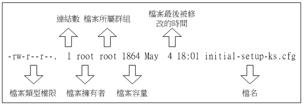

> 未完成，文件权限需要过一遍；其次是需要将目录配置标准的内容单独开一个md记录

# 文件权限

User, Group, Others (还有root)

`/etc/passwd` 存储账号信息, `/etc/shadow` 存储个人密码, `/etc/group` 存储群组信息

## 使用指令```ls -al```:




1. 文件类型权限：

    - 第一个符号：-表示文件, d表示目录 (l, b, c 暂不记)
    - r w x 分别代表 read, write, execute
    - 2~4 Owner, 5~7 Group, 8~10 Others

2. 连结数：i-node，作用尚不明确（不同的文件名连接到相同的i-node数?）

3. 拥有者
4. 所属群组
5. 文件大小 (byte为单位)
6. 最后修改日期

    - 太久了需要用 ```ls -l --full-time```
    - 乱码需转码 ```export LC_ALL=en_US.utf8``` (ubuntu似乎不太一样)

7. 文件名
    - . 开头为隐藏文件


> 和Windows使用`.exe`来表示文件可执行不同, Linux是通过文件权限`x`来决定的

## 文件权限的更改
- `chgrp`
- `chown`
- `chomod`: r(4) + w(2) +x(1)


## 目录文件的权限

- r 表示可以`ls`这个目录
- w 表示可以操作这个目录结构，包括
    - 在里面新建文件、目录
    - 目录内删除文件、目录：**这里不需要再看这些的权限?**
    - 更名、搬移目录内文件、目录
- x 可以进入这个目录，执行这个目录下的文件

**注意**：对于 w 操作的分配需要比较谨慎，下面是一个例子：<br>
假设有某个用户testUser, 则其工作目录为 `home/testUser`，而假设在这里面有一个重要的系统配置文件:
```
-rwx------ root root [a time] the_root.data
``` 
这个用户的确无法读、编辑、执行这个文件，**但它却可以删除和移动它**；这个过程就像有人把一个密封的文件放到你的保险柜里，虽然你拆不开这个文件，但你却可以销毁它！

> 这里打个岔：新建用户需要先`useradd`, 然后`passwd`，单纯使用前者无法登陆，原因暂时没有去查

# Linux目录配置的依据--FHS

Filesystem Hierarchy Standard (FHS)标准

> 这里先把文件夹名字记录下来，以后在实践中逐渐积累经验，如果需要查阅信息可以

总分类：
- `/` (root) 与开机系统有关；
- `/usr` (unix software resource) 与软件安装/执行有关；
- `/var` (variable) 与系统运作过程有关

### /

FHS建议根目录越小越好

must: `/boot`, `/bin`, `/dev`, `/etc`, `/lib`, `/media`, `/mnt`, `/opt`, `/run`, `/sbin`, `/srv`, `/tmp`, **`/usr`, `/var`**

recommended: `/home`, `/lib<?>`, `/root`

not in FHS: `/lost+found`, `/proc`, `/sys`

### /usr

放置的资料属于**可分享的**与**不可变动的**(shareable, static)，软件安装相关

must: `./bin`, `./lib`, `./local`, `./sbin`, `./share`, 

recommended: `./games`, `./include`, `./libexec`, `./lib<?>`,  `./src`

### /var

经常变动的文件目录

must: `./cache`, `./lib`, `./lock`, `./log`, `./mail`, `./run`, `./spool`