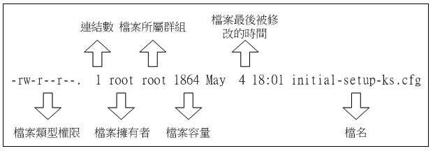

# 目录文件权限

## 用户与群组

> 这里是对用户和群组的一个简单介绍；更详细的账号权限在后面学完以后单独开一个笔记来记


在Linux里面，任何一个文件都具有 `user`, `group`及`others`三种身份权限(当然还有可以可以执行任何操作的的`root`)

- `user` 对应文件的所有者
- `group` 对应该文件所支持的群组
- `others` 即除上面两个以外的用户

> 注意每个文件 **只支持一个Group**, 因为用户可以分配到多个 Group, 就已经能实现权限的任意组合了

- 用户 UID: root = 0, 系统用户 = [1, 999], 普通组 = [1000, 65535] (CentOS7)
- 组 GID: root = 0, 系统组 = [1, 999], 普通组 = [1000, 65535] (CentOS7)

相关存储文件: 
- `/etc/passwd` 存储 User 的信息
- `/etc/shadow` 存储 User 的密码
- `/etc/group` 存储 Group 的信息


## `ls -al`查看文件属性:

这个指令列出指定位置所有**文件+目录**的详细的权限与属性 (包含以`.`开头的隐藏文件/目录)




1. 文件类型&权限(10个字符)：
    - 1：类型
      - `-` 普通文件，`file`命令可查看具体类型
      - `d` 目录 
      - `l` 软链接
      - `b`, `c` 分别是随机存储设备(硬盘) 和 字符设备(终端、键盘、鼠标)
      - `p` 命名管道
      - `s` 套接字
    - `r` `w` `x` 分别代表 read, write, execute
    - 2~4: `owner`所具有的权限
    - 5~7: 加入该`group`的用户所具有的权限
    - 8~10: `others`的权限
2. 连结数：该文件名对应连结的 i-node 实际连结的文件名数(之后会详细讲，这里理解为类似“引用计数”即可)
3. 拥有者
4. 所属群组
5. 文件大小 (byte为单位)
6. 最后修改日期
    - Linux不保存文件的创建时间
    - 太久了需要用 ```ls -l --full-time```
    - 乱码需转码 ```export LC_ALL=en_US.utf8``` (ubuntu似乎不太一样)
    > 另外如果要修改系统语言，需修改`/etc/locale.conf`的`LANG`参数
7. 文件名
    - `.` 开头为隐藏文件
    - `ls`指令的`-a`参数会显示隐藏文件

> 和Windows使用扩展名`.exe`来表示文件可执行不同, Linux是通过文件权限`x`来决定的

## 权限的更改
- `chgrp` 
- `chown`
    - 不仅可以改变owner, group也可以一并改
    - `chown user:group file`
- `chomod`: r(4) + w(2) +x(1)
    - `+ - =`
    - `u g o a`
    - 例子 `chmod u=rwx,g+x,o-x filename`

### 文件权限意义

- `r` - 可读取该文件内容
- `w` - 内容可以被修改 (但不代表文件本身能被删除、移动或重命名)
- `x` - 可被执行(类似Windows的exe)

### 目录权限意义

- `r` - 可以`ls`这个目录看有什么文件
- `w` - 可以操作这个目录结构，包括新建、删除、重命名、移动该目录下的文件或目录
- `x` - 可以进入这个目录并成为工作目录，可以`cd`进去或执行这个目录下的文件
  - 如果只有`r`没有`x`，虽然可以看到目录内文件名字，但其他信息是看不到的，也就更加无法`ls`目录内的子目录了。

**注意**：对于`w`权限的分配需要比较谨慎，下面是一个例子：<br>
假设有某个用户`testUser`, 则其工作目录为 `home/testUser`，而假设在这里面有一个重要的系统配置文件:
```
-rwx------ root root [a time] the_root.data
``` 
这个用户的确无法读、编辑、执行这个文件，**但它却可以删除和移动它**；这个过程就像有人把一个密封的文件放到你的保险柜里，虽然你拆不开这个文件，但你却可以销毁它。

> 这里打个岔：新建用户需要先`useradd`, 然后`passwd`，单纯使用前者无法登陆，原因暂时没有去查 (这段旧的笔记莫名其妙)

## 文件预设权限 `umask`

- 新建一个目录或文件时的预设权限
- 使用 `umask` 或 `umask -S` 查看，前者输出的数字有4位，首位为特殊权限，后面3位就是平常的`rwx`
- umask 记录的是 **减去的权限**，而无论何时文件都会减去`x`
- 预设umask
  - 可以参考`/etc/bashrc`
  - `root` 022, 也就是只有`root`有`w`
  - 普通用户 002，即所属用户和群组都有`w`

## 文件隐藏权限

- `chattr`更改(`+,-,=`)，`lsattr`查看隐藏权限(有点像`ls`)
- 在Linux传统的Ext2/Ext3/Ext4文件系统下完整支持，xfs不完整支持
- 比较重要的参数
  - `a` ：文件将只能增加内容，而不能删除也不能修改内容，仅`root`才能设定这属性
  - `i` ：文件不能被删除、重命名、设定链接也无法写入或新增内容，对于系统安全性有相当大的助益！仅`root`能设定此属性

## 文件特殊权限

### `SUID`

- `SUID` 权限仅对可执行文件(binary program)有效（shell脚本也不行！）
- 执行者对于该文件需要具有`x` 权限
- 仅运行时有效，执行者拥有该程序`Owner`的权限
- 权限标识`s`，占用所属用户权限的`x`

例：普通用户使用`/usr/bin/passwd`修改代码
- 该程序所有者是`root`
- 目标修改文件是`/etc/passwd`，普通用户无法直接改，`root`可以
- 普通用户运行`/usr/bin/passwd`时，可以间接修改`/etc/passwd`文件

### `SGID`

- 作用在**可执行文件**上时，和`SUID`类似，不过相对于用户，这里是群组。因此`s`占用的是所属群组的`x`而不是所属用户的`x`
- **目录**也可以设置`SGID`，
  - 使用者在此目录下的有效群组(effective group)将会变成该目录的群组
  - 用途：若使用者在此目录下具有`w`的权限(可以新建档案)，则使用者所建立的新档案，该新档案的群组与此目录的群组相同。**换句话说就是：组内的人创建的文件还是这个组而不是默认用户自己的组**

关于这个目录的`SGID`举个实际的例子帮助理解比较好：
- 比如两个用户`A`和`B`要合作做个项目，共享一个目录`dir`
- 用普通权限的思路就是，建一个群组`grp`，把两人拉进去，再给`dir`分配组和组的权限
- 但这样有问题：`A`在`dir`里新建一个文件，默认所有者和群组都为`A`(群组就是`A`的初始同名群组)，这就导致`B`可以删除它，但却不能修改它（没有合作内味）
- 如果给`dir`加一个`SGID`，那样两个用户在`dir`里新建的文件所属群组就都是`grp`啦

> 可以看到还是相当有用的东西

### `SBIT`

- 仅对目录有效，使用者在该目录下创建(前提是有`w`,`x`)的文件只有`root`和自己可以删除
- 原目录的所有者都不能删除
- 用途：公共目录下，每个用户只能够针对自己建立的文件或目录进行删除/更名/移动等动作
- 权限显示会占用`others`的`x`，显示`t`

### 特殊权限的设置

`chmod` 4 bits, 第一位就是特殊权限

- 4 为SUID
- 2 为SGID
- 1 为SBIT

注意，这三个权限都需要`x`的存在，否则都是无意义的。假如不设置`x`而设置特殊权限，就会出现大写的 `S`, `T`。如下面的例子：

```sh
[root@study tmp]# chmod 7666 test; ls -l test  <==具有空的SUID/SGID权限 
-rw S rw S rw T 1 root root 0 Jun 16 02:53 test
```

也可以用符号法来设置

- `u+s` 为SUID
- `g+s` 为SGID
- `o+t` 为SBIT 