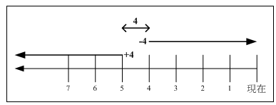

# 目录文件基本操作

## 绝对路径与相对路径

- 绝对路径：**指以根目录为起点的路径名**。开头为`/`，例如： `/usr/share/doc`。
- 相对路径：**指相对于当前工作目录的路径**。开头不是`/`，例如：从`/usr/share/doc`要去`/usr/share/man`目录时，可以写成`$ cd ../man`。

## 目录文件管理

### `cd`

更换目录

- `.` 表示当前目录（一个文件）
- `..` 表示上层目录，根目录的`..` = `.`（一个文件）
- `~` 表示当前用户的家目录（环境变量）
- `cd -` 即返回上一个目录（环境变量，即`${OLDPWD}`）

### `tree`

图形化显示目录结构，需要手动安装 `yum install tree`

- `--inodes` 显示inodes
- `-L #` 限定层数

### `pwd`

显示当前所在目录，即`echo ${PWD}`
- `-p` 如果是软链接，显示实际链接到的位置

### `mkdir`

创建文件夹
- `-p` 递归创建不存在的父目录
- `-m` 忽略umask预设属性，重新设定目录权限
- `-v` 显示详细创建过程

### `rmdir`

删除**空**目录

-	`-p` 递归删除空的父目录
- `-v` 显示详细删除过程

### `ls`

查看某个目录下的文件、子目录列表

- `-a` 列出全部（包括隐藏）文件
- `-R` 递归显示目录的子目录内容（注意R大写）
- `-d` 查看目录自身
- `-l` 长列表
- `-h` 文件大小加单位
- `--full-time` 以完整时间模式(包含年、月、日、时、分) 输出
- `--time={atime,ctime}` 输出访问时间(atime)或改变权限属性时间(ctime), 而非修改时间(modification time)
- `ll` 即`ls -l`

### `cp`
> 多多复习，感觉这就可以写个博客了啊
复制文件or目录

**参数**：
- `-d` 默认情况下复制软链接会把链接结果文件内容复制过来，-d可以取消这一操作，纯粹复制链接文件
  - 等价于 `--no-dereference --preserve=links`
  - (但CentOS8实际实验中感觉只要 `--no-dereference` 就可以了)
- `-R/-r` 递归复制目录
- `-a` 归档功能，等同于 `-dR --preserve=all` (**常用**)
- `--preserve` 默认(mode, ownership, timestamp),还有(links, all...)，`-p` 即前三个默认值(**常用**)
- `-i` 覆盖前交互确认(**常用**)
- `-s` 即 `ln -s`，但只能针对文件而目录不行
- `-l` 即 `ln`，同上只能针对文件
- `-f` 强制覆盖(先删除后复制)(**常用**)
  
**多种复制形式**：
- 单源复制 
  - `cp [OPTION]… [-T] SOURCE DEST`,其中`-T`即treat DEST as a normal file
  - `DEST`不存在，则创建并复制文件内容（当然父目录不存在会报错）
  - **`DEST`存在且非目录，则覆盖（覆盖前进行提示使用 `-i`）**
  - **`DEST`存在且为目录，则enter`DEST`并复制一个和源文件同名的文件**
- 单源目录复制
  - 默认会略过目录，`-r`则对整个目录进行递归复制
  - **`DEST`不存在，则会在父目录中新建一个`DEST`名目录，并复制`SOURCE`内文件进去**
  - **`DEST`存在，则enter`DEST`并新建一个`SOURCE`名同名目录并搬移文件**
  - **`-T` 不会新建目录，而是直接“解压” `SOURCE` 下的文件到`DEST`**
    - `-T`即`treat DEST as a normal file` 就不会enter该目录了
    - 用于已存在的文件夹**增加**从源文件夹复制过来的内容，也可以理解为**两个目录的合并操作**
    - 等效于`cp -r SOURCE/* DEST`，这样实际上是多源复制
    - 注意如果`SOURCE`是文件`DEST`是目录的话，`DEST`会被覆盖成文件的）（**并不会，会报错**）
- 多源复制
  - `cp [OPTION]… SOURCE… DEST`
  - `cp [OPTION]… -t DEST SOURCE…`
  - `DEST`不存在或不是目录，都会报错

### `rm`

删除文件和目录
  - `-r` 递归删除目录，**谨慎使用**
  - `-f` force，忽略不存在的文件，不会出现警告
  - `-i` 交互式删除
  - 彻底粉碎文件用`shred`指令

### `mv`

移动和重命名目录和文件
  - `-i` 交互式覆盖
  - `-f` 直接强制覆盖
  - `-T` 会使源目录替换掉目标空目录，`DEST`非空会报错

### `rename`

更灵活的重命名

-	`rename [options] expression replacement file`
- 例：将所有 xx.txt 转化为 xx.txt.bak
  ```shell
  $ rename '.txt' '.txt.bak' *.txt
  ```

### `basename`, `dirname`

分别显示一个路径的最终文件名和目录（其实就是做了简单的string split）。
```shell
$ basename /etc/sysconfig/network 
network
$ dirname /etc/sysconfig/network 
/etc/sysconfig
```

```sh
echo "TEXT" >> file
```

## 查看和操作文件内容

### `cat`, `tac`, `nl`

`cat`和`tac`分别是正序和倒序按行输出文件内容
- `-n` 带上行号, 类似`nl`，但`nl`可以对行号显示做更多的设计

### `head`, `tail`

取出文件前几行/后几行

- `head -n #` 取前#行，`head -n -#`取除了最后#行
- `tail -n +#` 取#行以后的资料，`tail -f` 持续监测新写入并输出
- 例：取某个文件的第11-20行（运用管道）
  ```sh
  head -n 20 /etc/man_db.conf | tail -n 10 
  ```

### `more`, `less`
`more`和`less`都是分屏查看文件的程序，但`more`翻到末尾就退出了，功能不如`less`全；man page就是基于`less`的。因此主要操作和man page类似就不多说了。

### `od`
输出非文字档

### `touch`

改变文件时间戳（access 和 modify）文件不存在会创建空文件。
- `-c` 即 `--no-create`
- `-a` 仅修改 access time
- `-m` 仅修改 modify time
- `-t` 指定时间
> 什么时候会有改变文件时间戳的场景

### `stat`

显示文件或文件系统的状态（元数据 metadata）

大小、所在存储区域、inode、最近access、最近modify、最近change(元数据改变)(modify --> change, 但chagne !--> modify)

### `>>`

追加到文件

### `tr`

> 在管道会更详细提，这里简单介绍一下罢了

translate or delete characters

- 按字符替换 `tr 'abc' 'xyz'`
  - de按z替换 `tr 'abcde' 'xyz'`
  - 后面mn会被忽略 `tr 'abc' 'xyzmn'`
- 使用标准输入输出，因此需要配合管道
- 不能这样使用重定向，会变空 `tr 'A-Z' 'a-z' > /app/test < /app/test`
- `-c` 取反，`-d` 删除，`-s` 压缩重复，`-d` 严格对位
- 例：将windows的`\r\n` 转为 `\n`：
  `tr -d '\r' < fn > fn2`

### `hexdump`

输出二进制（按每8位，即每字节）

- `-C` 按ASCII
- `-c` 按显示字符

### `vim`

这个文本编辑器之后会详细讲。

## 文件/指令查找

### `which`查找指令

没什么好讲的

### `whereis`,`locate`查找文件

`whereis`只找系统中某些特定目录下的文件，`locate`则是利用数据库来查找文件，因此效率要比`find`硬找快很多（当然也很有局限性）
- `locate`数据库位于 `/var/lib/mlocate/`
- `updatedb`：根据 `/etc/updatedb.conf` 的设定去查找硬盘内的文件名（会需要一定的时间） ，并更新`/var/lib/mlocate`内的数据；

### `find`查找文件

`find [option] [PATH] [expression]`
- `PATH`可以多个路径
- 以下列出的“参数”其实属于`expression`部分了
- **与名称和权限有关的参数**：
  - `-name` 查找指定名称文件
    - 可以使用正则，比如 `find / -name "*passwd*"`
  - `-size` 指定大小
    - [+ -]size即大于或小于size
    - 单位：c - 代表byte; k: 代表KByte
  - `type` 文件类型
    - 普通文件(f), 设备文件(b, c), 目录(d), 链接(l), socket(s), FIFO(p) 等
  - `perm` 权限(数字)
    - `perm mode` 即相等的权限（=）
    - `perm -mode` 即必须至少包含mode的权限（&）
    - `perm /mode` 即至少包含一项mode的权限（|）
- 与时间有关的参数：
  - `-atime`,`-ctime`,`-mtime`,`amin`,`-cmin`,`-mmin`，前三个以天为单位，后三个以分钟为单位。下列用`-mtime`说明
  - `-mtime n` ：列出n*24h之前的24h之内被modify过的文件 `((n+1)*24, n*24)`
  - `-mtime +n` ：列出在(n+1)*24h之前被modify过的文件 `(,(n+1)*24]`
  - `-mtime -n` ：列出在n*24h之内被modify过的文件 `[n*24, )`
  - `-newer file` ：列出比file还要新的文件
  - 以`4`为例：
  - 例：将24小时内modify过的文件列出
    - `find / -mtime 0`
    - 0表示当前时间
  - 例：寻找`/etc`中文件日期比`/etc/passwd`新的文件 
    - `find /etc -newer /etc/passwd` 
    - >疑问：这是什么时间？

  - `-daystart` 有关时间的选项从0时记
    - 比如 `find / -daystart -mtime 0` 不是24小时内，而是**从今天0时往前的24h内**
- 与用户有关的参数：`-uid`,`-gid`,`-user`,`-group`,`-nouser`,`-nogroup`
  - `uid` 和 `gid` 使用数字，分别来自`/etc/passwd` 和 `/etc/group`
  - `user` 和 `group` 则使用具体用户名和组名
  - `-nouser` 和 `nogroup` 分别表示不存在`/etc/passwd`的用户和不存在`/etc/group`的组
    - 假如系统删除了用户和组，或者自行安装了某些自由软件，就有可能会发生这种情况（虽然后者这种情况我暂时想不出来会怎么发生）
- 额外动作参数
  - `-print` 会把搜寻过程中经过的路径文件都列出；
    - 默认参数，所以如果没有其他`expression`的话，搜寻的内容会全部打出来
    - > 一开始很疑惑为什么 `find / filename` 这样的指令会输出那么多东西，原来我的这个filename根本就用错了，要用`-name filename`才会被识别为expression
  - `-exec` 执行另外的命令处理搜寻结果
    - `{}`表示`find`得到的结果内容（依次执行）
    - `;` 是结束符，而且需要`\`做bash转义（也就是`\;`）
    - 不支持alias
    - 例：`find /usr/bin /usr/sbin -perm /7000 -exec ls -l {} \;`