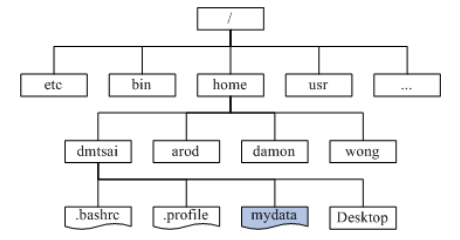

# 主机规划与硬盘分区

> 这一部分关于硬盘和开机的内容实在是太重要了，需要经常翻阅

## 参考资料

- [鸟哥的Linux私房菜](http://linux.vbird.org/linux_basic/0130designlinux.php)

## 设备
在Linux系统中，每个设备都被当做一个文件来对待

> 在Android中的虚拟机也被当做设备```/dev/kvm```，在后面了解到kvm不仅仅是用作Android虚拟机这么简单

[各种设备命名](http://linux.vbird.org/linux_basic/0130designlinux.php#hardware_no)

## 虚拟机

Linux系统内置 **KVM** 进行虚拟机操作，但实际上现在VirtualBox已有Linux版本，所以无需再使用命令行配置启动虚拟机，使用VirtualBox是个不错的选择。我也也尝试了用虚拟机制作WindowsXP+CentOS双系统，具体可以看[这里](basic/doublesys.md)

> 其实主要是kvm用不会啦，第一次安装ubuntu就失败了，以后再尝试


## 硬盘

整颗**硬盘的第一个扇区**特别的重要，因为他记录了整颗硬盘的重要资讯，最重要的就是MBR(或者向下兼容MBR的**GPT**）

**MBR和GPT:** <br>
它们是两种硬盘“分割”的方式—— 早期硬盘第一个扇区里面含有的重要资讯我们称为**MBR (Master Boot Record)** 格式，但是由于近年来硬盘的容量不断扩大，造成读写上的一些困扰， 甚至有些大于2TB 以上的硬盘分区已经让某些操作系统无法存取。因此后来又多了一个新的硬盘分区格式，称为 **GPT (GUID partition table)**！这两种分区格式与限制不太相同

**MBR分区的规则：**<br>

通过延伸分区，MBR可分割多于4个分区；但```dev/sda[1~4]```都是分配给主分区/延伸分区，逻辑分区就列到后面去了（从```sda5```开始计数)

- 主要分区和延伸分区最多只能有四个(硬盘的限制)
- 延伸分区最多只能有一个(操作系统的限制)
- 逻辑分区是由延伸分区持续切割出来的分分区；
- 只有主要分区和逻辑分区可以格式化，延伸分区无法格式化；
- 逻辑分区的数量依操作系统而不同，在Linux系统中SATA硬盘已经可以突破63个以上的分区限制；

如果你要分区超过4槽以上时，一定要有Extended分区，而且**必须将所有剩下的空间都分配给Extended**， 然后再以logical的分区来规划Extended的空间。另外，考虑到硬盘的连续性，一般**建议将Extended的磁柱号码分配在最后面的磁柱内**。

下面是我使用虚拟机安装双系统时对40G模拟硬盘的分配（具体过程见于[这篇笔记](virtual_double_sys.md))

- 1M ~ 15G : 主要分区1，用于安装CentOS (```sda1```)
- 15G ~ 30G : 主要分区2，用于安装WindowsXP (```sda2```)
- 30G ~ 40G : 扩展分区 (```sda3```)
    - 30G ~ 38G ：逻辑分区1，用于windows和cent共享数据 (```sda5```) 
        > 注意到这里从5开始，因为如前所述1~4分给了primary和extended
    - 38G ~ 40G : 逻辑分区2，用于换页，增强内存功能 (```sda6```)

**GPT 分区表**<br>

与 MBR 仅使用第一个 512bytes 区块来纪录不同， GPT 使用了 34 个 LBA 区块来纪录分割资讯！同时与过去 MBR 仅有一的区块，被干掉就死光光的情况不同， GPT 除了前面 34 个 LBA 之外，**整个硬盘的最后 33 个 LBA 也拿来作为另一个备份**！这样或许会比较安全些吧！

在CentOS的安装过程中，可以发现硬盘格式为```BIOS boot```即为GPT分区表所需的备份空间

## 开机流程中的 BIOS 与 UEFI 开机检测程式

基本上，目前的主机系统在载入硬体驱动方面的程序，主要有**早期的 BIOS** 与**新的 UEFI** 两种机制

**BIOS 搭配 MBR/GPT 的开机流程**
1. BIOS：开机主动执行的韧体，会认识第一个可开机的装置；
> 在主板上；寻找可以开机的设备
2. MBR：第一个可开机装置的第一个扇区内的主要开机记录区块，内含**引导加载程序**；
> 在存储设备(硬盘)上，第一个扇区
3. 引导加载程序(boot loader)：一支可读取内核文件来执行的软体；
> Grub就是其中一种，可用于引导多系统
4. 操作系统内核kernel：开始操作系统的功能...

由上面的说明我们会知道，BIOS与MBR都是硬体本身会支持的功能，至于**Boot loader则是操作系统安装在MBR上面的一套软件**了。由于MBR仅有446 bytes而已，因此这个开机管理程式是非常小而美的。这个boot loader的主要任务有底下这些项目：

- 提供选单：使用者可以选择不同的开机项目，这也是**多重开机**的重要功能！
- 载入核心档案：直接指向可开机的程式区段来**开始操作系统**；
- 转交其他loader：将开机管理功能**转交给其他loader**负责。

> 也是要常常回看的内容呀

**每个分区都拥有自己的开机扇区**(boot sector), loader只会认识自己的系统槽内的可开机核心档案，以及其他loader而已;loader可直接指向或者是间接将管理权转交给另一个管理程式。

『**如果要安装多重开机， 最好先安装Windows再安装Linux**』呢？这是因为：

- **Linux**在安装的时候，你可以选择将boot loader安装在MBR或各别分区的boot sector， 而且Linux的loader可以手动设定选单(就是上图的M1, M2...) ，所以**你可以在Linux的boot loader里面加入Windows开机的选项**；

- Windows在安装的时候，他的安装程式**会主动的覆盖掉MBR以及自己所在分区的启动扇区**，你没有选择的机会， 而且他没有让我们自己选择选单的功能。

- 当然这种情况并不是无药可救! 可以选择**救援Linux系统**：以CentOS为例，重新插入CentOS的系统光盘(或者U盘)然后设置BIOS为光盘(U盘)启动，进入CentOS安装界面以后，不要选Install，选择Trouble Shooting, 具体可以看[这里](http://linux.vbird.org/linux_basic/0157installcentos7.php#multiboot_rescue)

**Example 一个实践的栗子**<br>

在还不懂开机流程的某一天，我将Ubuntu装到了一整个U盘上，然后发现开机进入Grub2（当时还不认识Grub2这个boot loader），而且也无法启动Ubuntu，然后惊慌的我赶紧将U盘内容格式化，又能直接进入Windows了。

当时重启后进入Grub2而不是直接进入Ubuntu说明**Ubuntu并没有安装成功**，因为虽然U盘的MBR的确安装上了Grub2作为Boot Loader，但是在检测到只有一个系统的时候，Grub2会直接引导开启操作系统。

然后格式化U盘以后又能重新启动Windows，是因为装Windows的硬盘从头到尾没有动过(包括其MBR), 因此虽然U盘启动的优先级高于Windows(自己的设置)，但由于系统没能在U盘的MBR(其实也有可能是GPT了)找到boot loader，因此转而向装有Windows的硬盘寻求启动了。

**UEFI BIOS 搭配 GPT 开机的流程**

- 与传统的 BIOS 不同，UEFI 简直就像是一个**低阶的操作系统**
- 硬件资源的管理使用轮询 (polling) 的方式来管理，与 BIOS 直接了解 CPU 以中断的方式来管理比较， 这种 **polling 的效率是稍微慢一些**的

>下面这一点，我在Dell笔记本上重装系统就遇到过；
- 此外，由于过去cracker 经常藉由BIOS 开机阶段来破坏系统，并取得系统的控制权，因此**UEFI 加入了一个所谓的安全启动(secure boot) 机制**， 这个机制代表着即将开机的操作系统必须要被UEFI 所验证，否则就无法顺利开机！微软用了很多这样的机制来管理硬体。不过**加入这个机制后，许多的操作系统，包括 Linux ，就很有可能无法顺利开机**喔！所以，某些时刻，你可能得要**将 UEFI 的 secure boot 功能关闭**， 才能够顺利的进入 Linux

## （重要）安装Linux时磁盘分区的规划

**目录树的文件系统(挂载)**

Linux文件系统呈“目录树”的逻辑形式（见下图），所有的文件和文件夹都是由根目录 (`/`)衍生而来



逻辑形式如此，但前面的学习中我们知道文件都是存放在划分好的磁盘的，那目录树和硬盘空间又是怎么对应的呢？答案是 **挂载mount**

所谓的挂载就是**利用一个目录当成分区的进入点**，将磁盘分区的资料放置在该目录下；也就是说，进入该目录就可以读取该分区

> 实际上Windows也是采用的挂载的做法；但Windows的挂载常常就是 `C:` `D:` 这样的盘符形式，显得就好像是直接进入磁盘当中；而Linux的挂载更灵活，`/`一个挂载， `/home`又一个挂载, `/home/space`又一个挂载

**硬盘分区规划**

建议使用自定义分区，这样更有助于了解系统分区方式,并在日后熟练以后构造适合自己的分区

初次自定义分区，只需要分割成两个分区: `/` 和 `swap` 即可；当然建议预留一些分区作备份和日后再分区的使用。

进阶分区，给下列所需空间大且读写频繁的目录单独挂载磁盘分区，避免在这些目录Error时影响到根目录的资料：`/boot` `/home` `/var`；这些目录的具体含义和作用会在之后的笔记中讨论