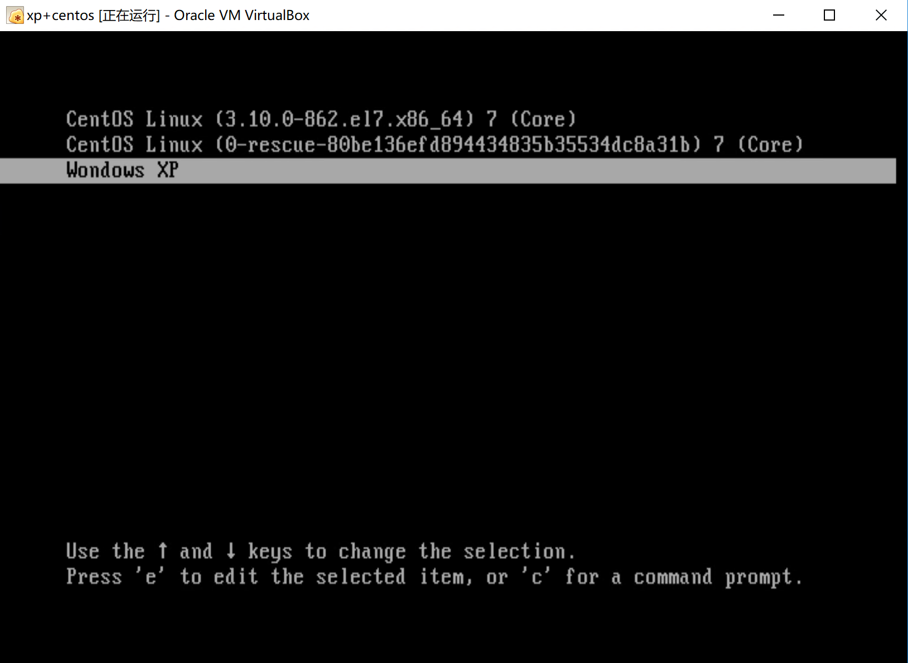

# VirtualBox安装 WinXP+CentOS双系统

建议在开始之前，先在[这里](http://linux.vbird.org/linux_basic/0130designlinux.php)学习分区和开机的知识，然后按照[这个](http://linux.vbird.org/linux_basic/0157installcentos7.php)步骤把CentOS单系统安装成功之后，再来看这里。

## 参考资料

- [鸟哥Linux私房菜 - 多重开机安装流程与管理](http://linux.vbird.org/linux_basic/0157installcentos7.php#multiboot)
- [Grub2配置文件详解](http://www.jinbuguo.com/linux/grub.cfg.html)


# Let's Go

采用的是先装 CentOS, 再安装Windows的过程，体验一下 “救援” 被Windows覆盖的MBR的过程

## 下载

XP ISO 安装版，有些版本是所谓 装机版 是不能在Virtual Box跑的，它需要在Windows下打开来运行；我们需要的是ISO映像 [这个](http://www.2013xp.com/xp/3057.html)就可以

CentOS-7 minimal, 官网下载即可

## 新建虚拟硬盘

> 这一步很关键

由于XP系统只能识别IDE硬盘，因此在新建系统时如果选择Ubuntu，Win10之类的都会自动分配一个SATA硬盘，这会导致WindowsXP无法识别，从而安装失败。

选择Linux->其他Linux系统则会分配IDE接口的硬盘。另外，直接选择XP系统会导致CentOS中途无法安装，原因暂时不明

> 还需继续研究

## 使用CentOS分区并安装CentOS

当然WindowsXP也能进行分区，只不过界面和功能来说还是CentOS更胜一筹；详细的步骤跟着 [鸟哥的教程](http://linux.vbird.org/linux_basic/0157installcentos7.php#multiboot_design)就行了。当然博主的分区规划和鸟哥的略有不同，如下所示：

- 1M ~ 15G : 主要分区1，用于安装CentOS (```sda1```)
- 15G ~ 30G : 主要分区2，用于安装WindowsXP (```sda2```)
- 30G ~ 40G : 扩展分区 (```sda3```)
    - 30G ~ 38G ：逻辑分区1，用于windows和cent共享数据 (```sda5```) 
        > 注意到这里从5开始，因为如前所述1~4分给了primary和extended
    - 38G ~ 40G : 逻辑分区2，用于换页，增强内存功能 (```sda6```)

## 安装WindowsXP

重新设置一下启动的ISO镜像，选择WindowsXP镜像启动，然后安装，注意别安装错了（当然如果不小心点了CentOS的系统盘会有提示上面装了系统）

安装完以后，虚拟硬盘的MBR就被WindowsXP的boot loader “霸道”地覆盖了，重启就只能进入WindowsXP系统

## 救援MBR内的Boot Loader

此时我们需要替换MBR的boot loader，不能再让XP占用下去了！网上很多建议装双系统是先装Windows再装Linux，是因为很多Linux版本自带了一个强大的 boot loader - grub2, 它可以实现多重引导（其实本质上就是引导到某个分区的booting section上而已）

现在在MBR被覆盖的情况下，我们仍然能通过CentOS的安装程序进行“救援”：关机，切换CentOS的ISO镜像，然后按照[鸟哥的教程](http://linux.vbird.org/linux_basic/0157installcentos7.php#multiboot_rescue)进行救援

## Grub2设置

鸟哥的教程里有一部分对Grub2的设置，乍一看还是蛮困扰的，幸亏看了这一片[教程](http://www.jinbuguo.com/linux/grub.cfg.html)，我知道了```set root='(hd0,3)'```指的是第一块硬盘内的第三个主要分区；而博主的分区规划是把Windows安装在第二个主要分区，因此改成```set root='(hd0,2)```即可，**注意这里格式严格不能有多余空格哦！**

## 成功！

然后重启，就会发现 Grub2 多了一个WindowsXP，截图留念：



当然Windows也启动成功了：


<hr>

如有任何问题，可发邮件至 ```zys980808@126.com``` 告知我，感激不尽！