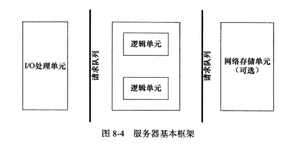
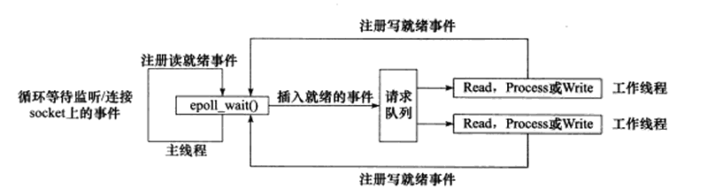
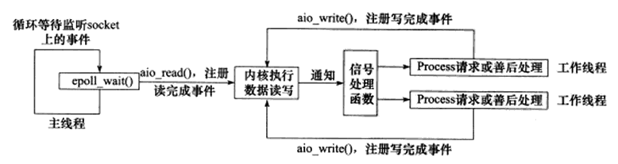
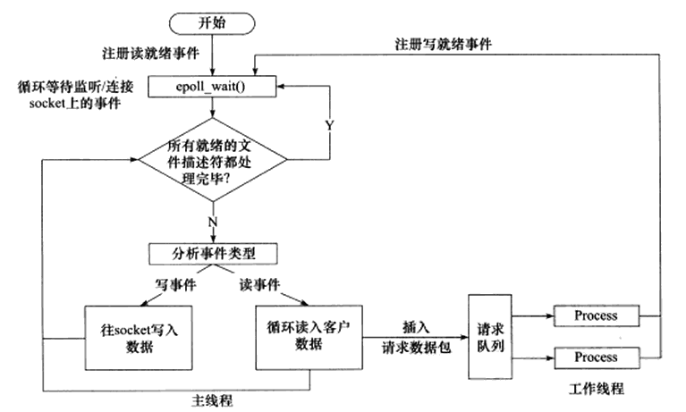
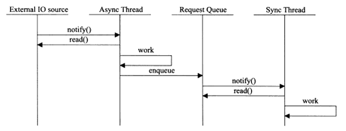
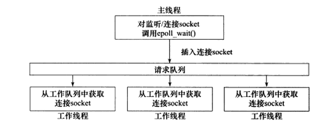
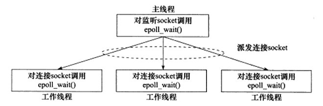

# 高性能服务器程序框架

> 全书的核心

## 服务器模型和编程框架

将服务器结构为三个主要模块
- I/O处理单元; 四种I/O模型和两种高效事件处理模式
- 逻辑单元; 两种高效并发模式，以及有限状态机
- 存储单元(暂不讨论)

client连接请求是随机到达的异步事件，因此服务器需要使用某种I/O模型来监听这一事件。

I/O处理单元等待并接受新的client连接，接收client数据，响应数据给client；数据的收发并不一定在I/O处理单元进行，也可以在逻辑单元，这取决于**事件处理模式**

## IO模型

socket基础API中，默认可能被阻塞的系统调用包括`accept`、`send`、`recv` 和 `connect`; 设置非阻塞以后，原本阻塞的调用会直接返回-1(和出错一致), 此时需通过errno来区分出错和阻塞;
- `accept`, `send`, `recv` 在事件未发生时errno通常被设为`EAGAIN`/`EWOULDBLOCK
- `connect` 在ACK未到达时errno会被设置成 `EINPROGRESS`

显然，我们只有在事件已经发生时操作非阻塞I/O，才能提高程序的运行效率。**因此非阻塞IO通常需要和其他IO通知机制一起使用**，比如I/O复用和SIGIO信号。

**I/O复用**是指：应用程序通过I/O复用函数向内核注册**一组事件**(而非单个)，内核再通过I/O复用函数把其中就绪的时间通知给应用程序。

**I/O复用函数本身是阻塞的**，能提高程序效率的原因在于他们能同时监听多个I/O事件(select, poll, epoll)。但**对I/O本身的读写操作是非阻塞的**(注意这里只是调用非阻塞，不是异步读写，同步读写的过程实际上还是“阻塞”的)

阻塞I/O、I/O复用、信号驱动I/O 都是 **同步I/O模型**，Linux的`aio.h`提供了对异步IO的支持

同步I/O，都是在I/O事件发生以后，由应用程序来完成的。异步I/O的读写操作总是立刻返回，真正读写由内核接管。也可以认为，同步I/O向应用程序通知的是I/O就绪事件，异步I/O向应用程序通知I/O完成事件。

## 两种高效的事件处理模式

服务器程序通常需处理三类事件：I/O事件、信号、定时事件; 此处先讨论对于事件的处理模式(两种)

### Reactor
主线程(I/O处理单元)只负责监听文件描述上是否有事件发生，有的话立即将该事件通知工作线程(逻辑单元)。读写数据，接受新的连接，处理客户请求均在工作线程完成。

自己的理解：
- Reactor译为“反应堆”，可以比喻一个事件引发的后续一系列事件。
- 通常在服务器就是将监听socket先放入`epoll_wait`的监听队列(`listen`即为事件0); 
- 随后新的连接到来，工作线程`accept`并将等待可读事件放入`epoll_wait`的监听队列(事件1); 
- 在数据可读写之后再次调用工作线程处理读写和后续逻辑(事件2)
- 这一系列的事件都是从事件0(`listen`)发起的

### Proactor
所有I/O操作都交给主线程和内核来处理，工作线程仅负责业务逻辑; 需要使用异步IO和信号处: 仍使用一个I/O复用函数用于监听新的连接，而读写都是使用异步I/O，I/O完成后使用信号处理函数调用逻辑单元进行处理

自己的理解：
- Proactor没有一个比较好的翻译，但pro就有“前向”的意思，act意为行动; 
- 对于Proactor模式，就是将读写预先注册给内核，让内核执行读写并推进逻辑的处理
- 和Reactor最主要的区别就是Reactor是内核只通知读写，实际读写由工作线程进行，而Proactor由内核接管读写，工作线程只通过信号处理函数获知读写已经完成

> 有个对Reactor和Proactor的区别有个蛮有意思的简明区别：reactor：能收了你跟俺说一声。proactor: 你给我收十个字节，收好了跟俺说一声。(转自知乎)

### 同步IO模拟Proactor

> 感觉这种粗糙的模拟没什么用, 效率低

可以使用同步I/O去模拟Proactor模式，目标仍是工作线程无需处理读写，那就使用主线程处理所有I/O事件，像Reactor一样同时监听连接和读写事件，并在每次调用I/O复用函数以后，在主线程将所有读写完成并通知工作线程处理

## 两种并发模式

TODO: 事件处理模式和并发模式的区别

多进程和多线程是两种实现方式，但不是模式; 并发模式是指I/O处理单元和多个逻辑单元之间协调完成任务的方法，主要两种：半同步/半异步模式，领导者/追随者模式

### 半同步/半异步模式

注意这里的同步异步和IO的同步异步概念完全不同：
- IO的同步异步区分的是内核向程序通知的是什么IO事件(就绪/完成)，以及谁来完成IO读写(应用程序/内核)
- **这里就是普遍的同步异步概念**，即顺序执行和异步执行(通过中断、信号来驱动程序执行)。
- 异步程序实时性好，但逻辑复杂、编写困难；同步程序反之；服务器应采取两者的结合

简单来说，半同步/半异步模式指的是
- 异步线程去处理I/O事件，插入请求队列
- 同步模式的工作线程读取并处理该请求

### 半同步/半反应堆模式

结合了事件处理模式中的Reactor(即反应堆)模式，此时异步线程就只有一个主线程, 且由工作线程执行I/O读写

> 实际上用了I/O复用函数，异步的主线程也被包装成了像是同步的调用方式。

TODO: 15章会有一个利用这种半同步/半反应堆编写的Web服务器

缺点：
1. 主线程(处理I/O的异步线程)和工作线程(处理逻辑的同步线程)共享请求队列，频繁请求锁消耗大量CPU时间
2. 每个工作线程同一时间只能处理一个请求; 线程过少容易导致请求堆积; 线程过多则工作线程的切换也会花费大量CPU时间

### 优化半同步/半异步模式

对于半同步/半异步模型存在的缺点进行优化：
- 主线程使用`epoll_wait`, 只管理监听新连接
- 新连接到来，主线程派发给某个工作线程(比如通过管道)
- 每个工作线程也使用`epoll_wait`, 监听连接的读写
- 每个线程都工作在异步模式，因此并非严格意义上的半同步/半异步

TODO: 15章会有一个利用这种优化的半同步/半反应堆编写的CGI服务器(到底什么是CGI)

### 领导者/追随者模式

- 多个工作线程轮流获得事件源集合，轮流监听、分发、处理事件
- 领导者同一时间只有一个，负责监听I/O事件; 追随者线程休眠;
- 领导者监听到I/O事件到来，有两种处理方式
  - 指派某个追随者成为新的领导者，原来领导者调用注册的处理函数处理I/O事件
  - 指派某个追随者处理，领导者身份仍不变
- 线程集的选举需要加锁防止竞态(包括初始领导者选举和后续领导者更替)
- 由于同一时刻领导者仅一个，因此仅支持一个事件集合，不像上面优化后的半同步/半异步模式每个工作线程可以独立管理多个连接
  - 但我认为这种情况可以通过增加同一时刻领导者数目来优化，锁从二元信号量变多元

TODO: 补充实现方法类图(句柄、句柄集、线程集、事件处理器）和时序图

## 有限状态机

逻辑单元内部的高效编程模式

TODO: 解析HTTP请求的示例程序，跟着敲一遍

## 提高服务器性能的其他建议

首要的因素是硬件资源; 这里要讨论的是如何从编程的角度提升性能; 前文提到的事件处理模式、并发模式、有限状态机 都有利于提升性能。

### 池

以空间换时间，预先将资源初始化，使用完不释放资源而是放回池中

根据资源类型，分为: 
- 内存池(预设缓存): 比如socket发送和接收的缓存
- 进程/线程池: 提升并发编程的运行效率
- 连接池: 比如需要频繁访问数据库的程序，可预设一些与数据库的连接

### 数据复制

应避免不必要的数据复制, **尤其是内核空间和用户空间之间**, 在可行时应使用零拷贝函数(例如`sendfile`)代替

用户空间之间的数据复制也要尽量避免，比如两个进程之间传大量数据，应考虑共享内存而不是管道、消息队列甚至socket; 同时也要避免同个程序内冗余的拷贝行为

### 上下文切换和锁

这两项都是并发程序需要着重考虑的：
1. **进程/线程切换时带来的开销**，线程过多会导致执行业务的CPU时间还少于切换的时间 (因此one-thread-per-client是不可取的)
2. **对共享资源的加锁带来的开销**，应尽量避免使用锁 
  优化后的半同步/半异步模式 在这点上就由于 半同步/半反应堆模式，前者由工作线程自行管理连接，而后者对事件队列需要加锁)